# Shell scripting 
For this auxillary project we will need to oboard 20 new Linux users onto a server. To do this
we must create a shell script that reads a csv file that contains the first name of the users
to be onboarded

First step is to create a new file called "onboarding_users.sh" and edit using Vi editor, we must
then input our shell script 

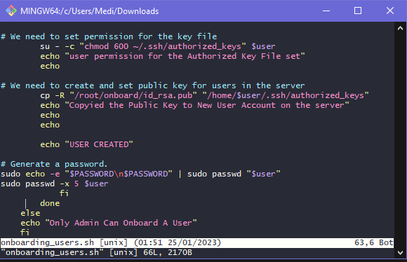 

Next we can use `scp -i PBL.pem onboarding_users.sh ubuntu@54.237.65.152:~/;` to copy our key to our EC2 instance, we can check to see if it has been transferred sucessfully by using `ls -l` after connecting to our EC2 instance 

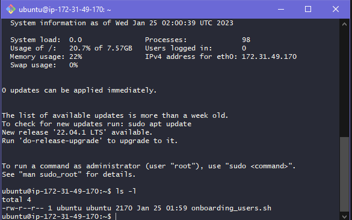 

We must then create a new directory called "Shell" `mkdir Shell` and create a new csv file called "names" `touch names.csv` once created we can open this file and input some random names 

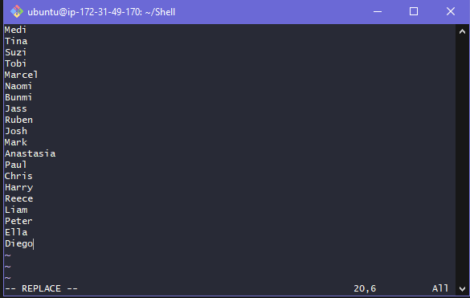 

Next step is to move our onboarding_users.sh file to our shell folder `mv onboarding_users.sh /home/ubuntu/Shell` and create the files "id_rsa" and "id_rsa.pub" 

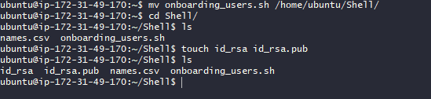 

Once created we must input our public and private key into the files using Vi editor 

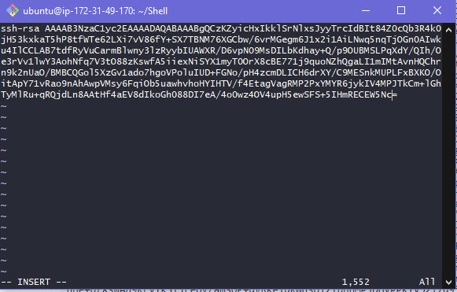 

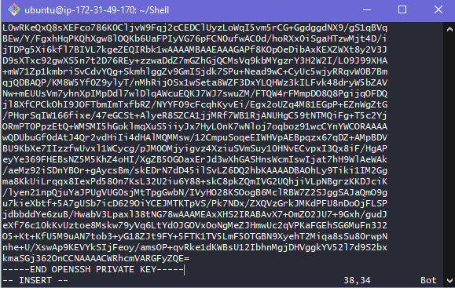 

After this we must now update our onboarding_users.sh file and update the path specified for our
public key 

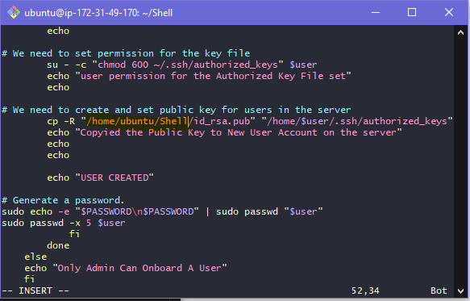 

Now we must now create the "developers" group for each of users `groupadd developers`, after this we must also make our onboarding_users.sh file executable using `chmod +x onboarding_users.sh`

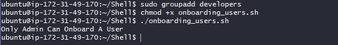 

To test if our script can run we must switch to super user `sudo su` and run `./onboarding_users.sh` 

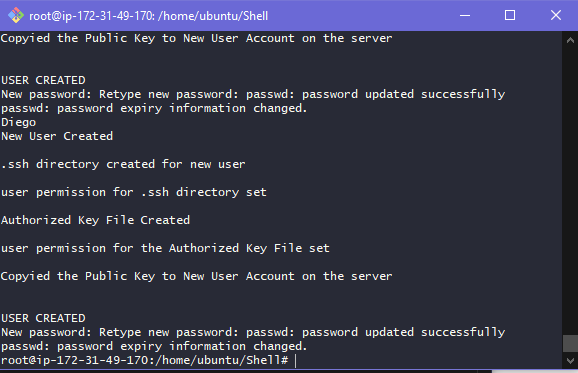  

We can see that a home for a users has been successfully creeated using `ls -l /home/`

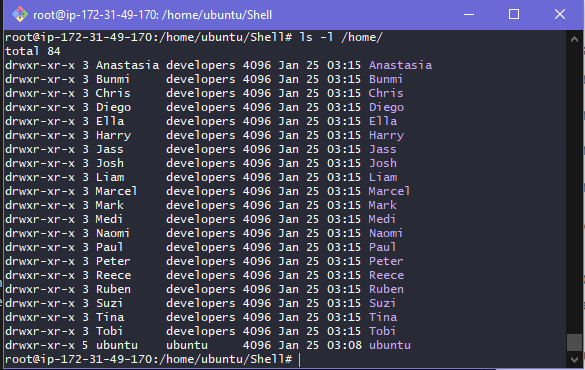   

To test users randomly and ensure these users can connect to the server we must connect using a seperate SSH client, after this we must create a new file named "auxillary-projects" and copy and paste our private key using Vi editor

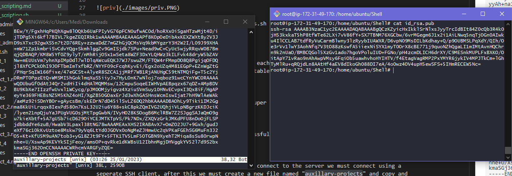   

Now you can run `ssh -i auxillary-projects.pem "User"@54.237.65.152` to connect to our EC2 instance, we should be able to connect succesfully as any user on the names.csv list

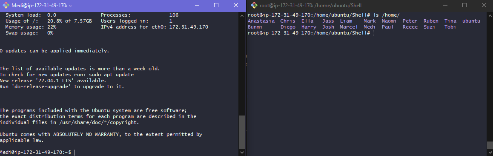 

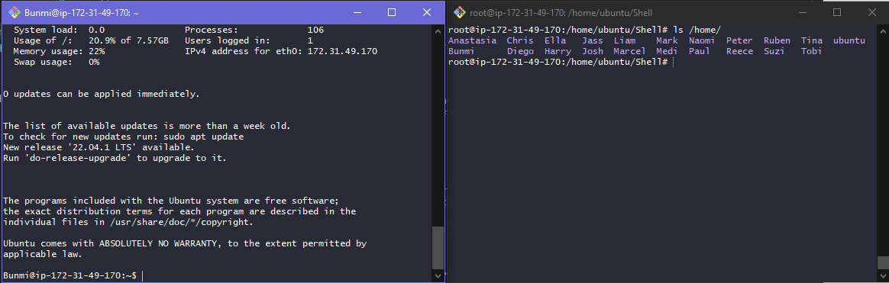 

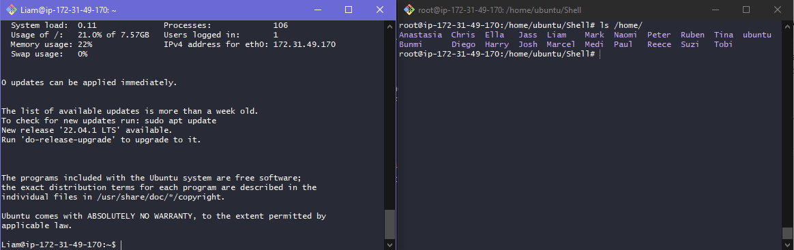  

*Tip: use `chmod 600 auxillary-projects.pem` to change permissions to keep private key safe*