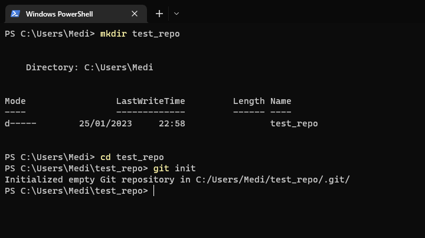
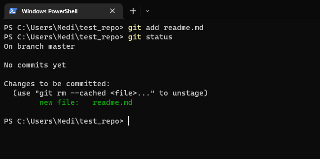
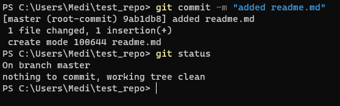
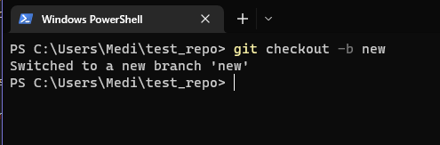
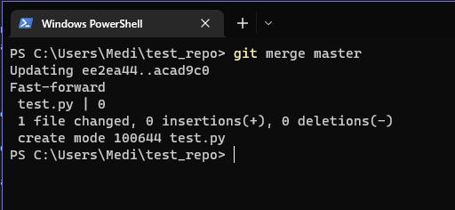
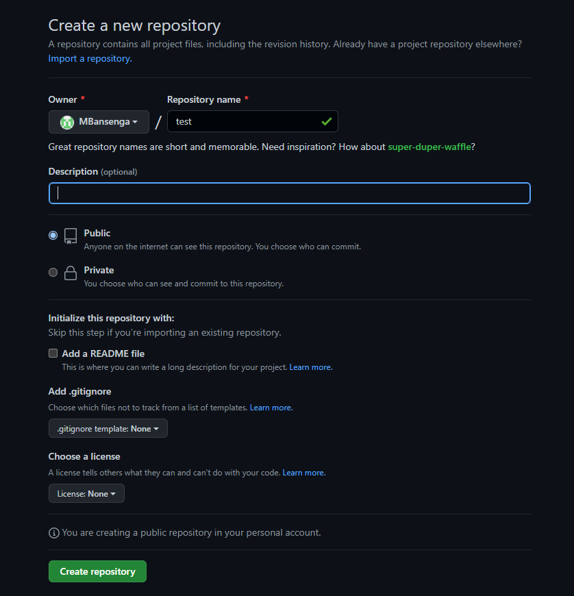
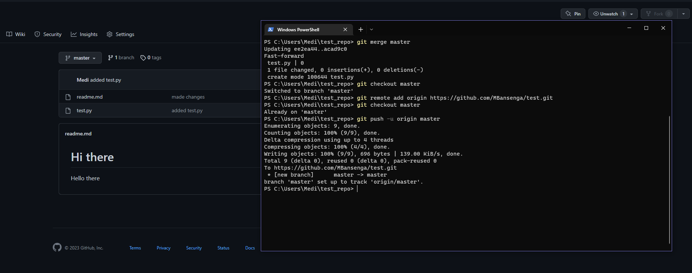
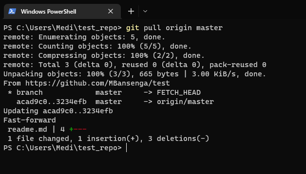

# Git introduction
Git and Github are two seperate things. Github is a website and provodes users with a UI, lets people host respositories and work collabaratively with others.
Git is a version control software 

 A repository is a place for code to be stored, Remote = Sits remotely, Local = Sits on your machine

 The remote repository has the most up to date code (version that is working) -> developers use this as a reference to make changes
 on their local repository 

 Github tracks the history of commits -> Commits are a change that you have made (Checkpoint - a way to return back if something goes wrong)

 Our local repository pushes commits to the remote repository which takes the code and merges it with the main branch 

 We can also pull from the remote repository which will pull any new commits and merge them with your current work since the last time you pulled changes 

# Branches

Master Branch -> The core code base (want to make sure this version works at all times -> developers can pull bad code and mess up their local repository)

Developers will create a new branch off the master branch -> Once they confirm everything is fine they merge this branch (all of their commits) with the master branch 
(Alligns commits in order they should go after merging with main branch)

You can update new branches with the changes made from the master branch without affecting it 

You can branch off new branches as well 

# Git walkthrough

To test Git we must first run `git init` in a newly created directory to initliaise our Git repository, once this is complete we can now run git commands within this directory everything created in the directory will also be tracked

 

The first step to commiting a change (make a checkpoint) is to add all the files you would like to
commit to the staging area, we can do this by running `git add readme.md` we can see files added to the staging area using `git status`

 

*You can also use `git add .` to stage all files you have made changes to*

After adding to the staging area we can now commit our changes using `git commit -m "commit message"` 

  

You can use `git checkout -b` to create and use a new branch, now any changes made to this branch will not happen on our master branch (we can use `git checkout master` to switch back)

 

To merge the changes to the master branch with the branch you are currently working on we can use
`git merge master` 

 

# Remote repositories 

We can set up a remote repository on GitHub by following these steps

 

Add a remote (URL to another repository) to ensure we can push changes to our remote repository and pull changes from it by running `git remote add origin https://github.com/MBansenga/test.git`  

We can then run `git push -u origin master` which will essentially push our commits to the "origin" repository on our main branch, the "-u" will allow us to push to our master branch using `git push` without having to specify which branch to push to  

  

To pull any changes from our remote repository we use `git pull origin master` 

 

