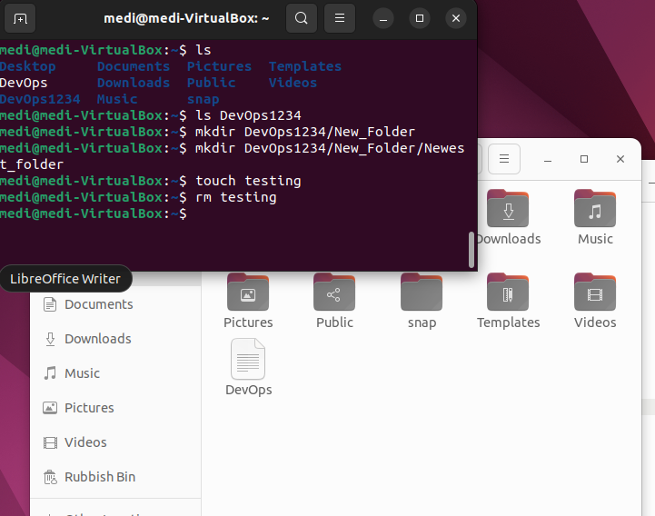
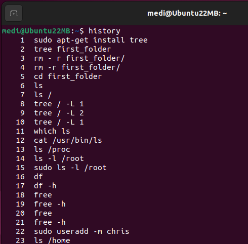

# Common commands 

1. `pwd` - This command writes the full pathname of current working directory 

  

2. `ls` - This shows you current files in working directory  

   

3. `touch` - This creates a new file  

  

4. `cat` - This shows you the content of a specified file, The tab button can be used as a shortcut method to specify which file you would like to choose 

    

5. `clear` - Can be used to clear the terminal, can also use ctrl + l     

6. `tail` - Used to display last section of file 

   

7. `head` - Used to display first section of file 

   

8. `which` - Shows you where a command is stored    

  

9. `info` and `man` - Gives you information on the function of a particular command  

   

10. `mkdir` -  Used to create a new directory, Up arrow button can also be used to bring back the previous command     

   

11. `cd` - This is used to change the directory you are currently working in 

   

 `cd -` - Takes you back to the last directory you were in, alternatively you can copy and past directory past after 'cd' command  

    

 12. `rmdir` - Used to remove a directory 

    

 13. `rm` - Used to remove   

 

 14. `cp` - Used to copy   

 

 15. `mv` - Used to move or rename   

 
 

 16. `echo` - This is used to return what you tell it to 

  

 17. Variables are used to assign value to an unknown, "Name" = varible, "Medi" = value
 The "$" sign is used to reference a variable 


18. `df` - Used to find out information of free space left on the disk 

 

19. `free` - Shows you the memory details 

  

20.  `id` - Shows you more information about the logged in user 

  

21.  `wget` - downloads files served with HTTP, HTTPS, or FTP over a network

22.  `curl` - (client URL) is used to transfer data to or from a server using a number of supported protocols 

23.  `vim` - (use i for insert, :w for write, :q for quit, :set number -> shows number next to each line)

24.  `less` - similar to  `cat` but allows you to return to terminal without clearing by pressing "q" 

25.  `diff` - Used to check the differences between two files, also tells you how to make files the same 

26.  `useradd` - Used to create new users 

   

27.  `passwd` - Sets password for a user 

    

28.  `grep` - Used to search for something (e.g. a string) within a file can use `cat | grep` or `less | grep` to find every line in a file that contains what is being searched for 

 

29.  `history` - Used to see history of commands used 

 

*Tip: You can use Ctrl + R to quickly access previously used commands*

*Tip: You can use ! to run the last command you ran* 

30. `stat` - Shows you the metadata of a file 

  

31. `chmod` - Used to change the permissions of a file 

  

32. `ln` - Used to link files together 

 

33. `su` - Allows you to switch users within the terminal 

 

34. `systemctl status` - Shows the status of a particular program 

 

 # Flags    
1. `ls -l` - Lists files in directory with more information 

   

2. `ls -a` - Includes . files in directory list 

   

3. `ls -la` - Combination of previous flags  

  

4. `rm -r` - Allows you to remove directories recursively    

   

5. `mkdir -p` - Used to create multiple directories at once 

  

6. `df -h` - Shows free disk space in human readable form (can also be used with `free`)

 

7. `df -i` - Shows us information on inodes (shows us how many files a particular file system can hold) 

  

8. `ls -i` - SHows you the inode number of a file 

  

9. `ls -latr` - Shows list of files in reverse order 

# Linux directories 

`tree` - Presents your directories in levels as a tree (must run `sudo apt-get install tree` first) 

 

`tree / -L 1` - Shows directories in root folder (/) in tree format, increase in number (2, 3 etc) will show subdirectories 

 

```
1. /bin is linked to usr/bin, this stores binary files -> Binary files are a compiled version of written code
2. /boot directory stores data relating to booting up the system 
3. /media, /mount, /cdrom, /mnt (all similar) are places where you attach your cd rom to your pc and access the files attached to them (mount point)
4. /dev the location of device files (device files are an interface to device drivers e.g. usb, external drive)
5. /etc is where the configuration files are kept (this tweaks and controls how program works) 
6. /home is where users keep specific files and folders 
7. /lib (Library) -> Libaries are a collection of resources used by the computer (group of functions) -> the operating system kernel uses the library when running programs
8. /lost+found is used for system recovery 
9. /opt (optional) used to store add on packages or software that is not tied to the system
10. /proc (process) contains processes (an instance of an application) -> when you run a program a process is generated for it 
11. /root is another folder like /home 
12. /run -> this directory is the mountpoint for tempfs filesystem in the computer's memory -> Temporary data used by processes are kept here 
13. /sbin (system bin) -> Binary files relating to the system are kept here 
14. /snap is where you will find packages relating to snap (alternative way to download packages like apt-get) 
15. /srv (server) is where certain server files are kept e.g. FTP files 
16. /sys (system) is mounted on a virtual file system 
17. /tmp is where temp files and directories are kept on disk -> files and folders get deleted after a reboot on a linux system
18. /usr is where programs and libaries are stored 
19. /var is used by the operating system to write data during the course of its operation 
```

# Linux inodes

Every file has metadata -> Metadata is data about data (Research more about inodes) 

# File Descriptors and Redirections 

When I process starts it uses many libaries e.g. every command on linux is a pogram -> each of these programs internally use libraries to function -> every time a command is used certain files in the library are opened which are very important for the Kernel to keep track of.

Only the Linux kernel can update the File Descriptor -> It is a way for the Kernel to help the program requesting for a particular file understand how to access it, where on the file system it is located 

File Descriptor points to the File table which then points to the Inode table  

Sometimes you may need to redirect the output of a program elsewhere instead of on the screen, you can use redirection to do this

 

The first three file descriptors are:

0. standard input (stdin) - represents data that you input into the system from your keyboard 
1. standard output (stdout) - data stream that prints onto the screen e.g. what you see after running `cat`
2. standard error (stderr) - represents the part of data that comes back as an error 

You can use `find / -name` to look for a particular file, the stdout will show stderr as well as the output you are looking for. You can also use `find / -name > "file.name"` which will only put the desired file location in the requested location

  

  
*Tip: use the `less` command to show this output* 

You can also use  `find / -name 2> "file.name"` to redirect the stderr output to a requested location, this is a cleaner way to do things 

   

You can use  `&` to send a process to the background and use `ps -ef | grep` to find the status of a particular process (ps is process status)

    

The command `lsof` can be used to show you the files that have been opened to run a specific process 

  

# Linux Terminal - user groups permissions 
Video missing for this

Permissions split into three groups: owner, group and all users 
Also split into three types: read, write, execute 

  

*For example "-rw-rw-r--" means for the owner = read and write permissions, group users = read and write permissions, all users = read permissions only (- at the start indicates if it is a file)*  


You can change the permissions of a file using `chmod u+-` 

  

Permissions can be of:

Read - 4

Write - 2

Execute -1

No permission - 0 

Permissions can be a combination of:

Read + Write + Execute = 7

Read + Write = 6

Read + Execute = 5

Write + Execute = 3

  

*For example `chmod 732` has changed file permissions to "rwe" for owner, "we" for group users and "w" for all users*

# Introduction to SSH

List of important definitions:
1. Client Server - between two programs/computers, client sends a request and server receives and processes the request
e.g. Internet -> browser itself is the client, server is the webiste you are trying to access 

2. Network Protocol - Any established set of rules that determines how data is transmitted between different devices e.g. TCP IP, HTTP, FTP

3. Algorithm - Set of rules or a process which needs to be followed to solve a specific problem commonly used in calculations 

4. Packet - Unit of data that is sent between devices 

5. Payload - The actual data within the packet (Each packet also contains some metadata)

6. Remote server - Any PC that is not physically attached to your keyboard/mouse/monitor is considered a remote server 

What is SSH?

1. SSH stand for Secure shell, it is a cryptographic network protocol -> standard set of rules used to transfer encoded packets over the network 

2. SSH allows you to connect to a remote server is a very secure manner 

3. SSH uses asymmetric cipher for encryption and decrption of packets

Disadvantages of SSH is that any misconfiguration of SSH can affect you from being able to login to the system again 


You can add users to the sudo file using the following steps below, must be careful when editing the sudoers file can check file using `visudo -c` after 

  

  

  

You are also able to create custom groups for members 

  

  

The same principle can be applied when configuring permissions for users to connect remotely via ssh by editing the "sshd_config" file, the # can be removed to allow the string to be executed. [no = root cannot access server at all, without password = cannot connect with private key]

 

*Tip: use "/" to search for a string within a file, you can use "n" to go to the next line your search appears*

You can test the "sshd_config" file for any errors using `sshd -t` no error output indicates everything is fine

 

Before changes made can be implemented we must use `systemctl restart` 


# Securely upload and download files remotely SFTP - SCP

-> Need to practice later once figure out how to connect EC2 instances 

# Process management 

Runnable state (R) - Has all resources but waiting for CPU to be free (CPU can only run one process at a time)

Running state (R) - Currently running on CPU

Sleeping state - Interruptable (S) = Can respond signals or Uninterrutable (D) = Cannot respond signals

Zombie (Z) - Happens when parent process dies before child process can be completed 

Ctrl Z or Ctrl C are signals used to either pause or kill a process 

Five main kill types 
1. SIGHUP
2. SIGINT
3. SIGQUIT
4. SIGILL 
5. SIGTERM 
