1. `pwd` - This command writes the full pathname of current working directory 
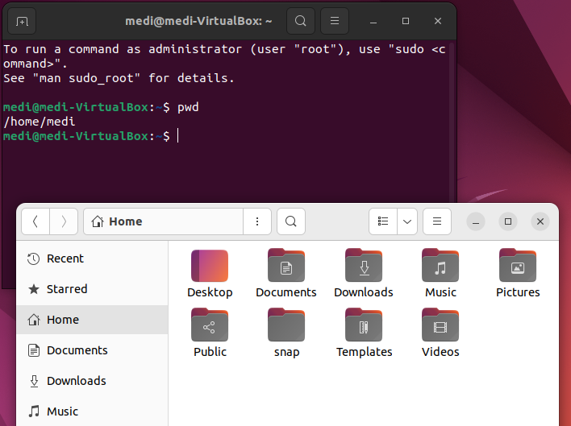  

2. `ls` - This shows you current files in working directory  
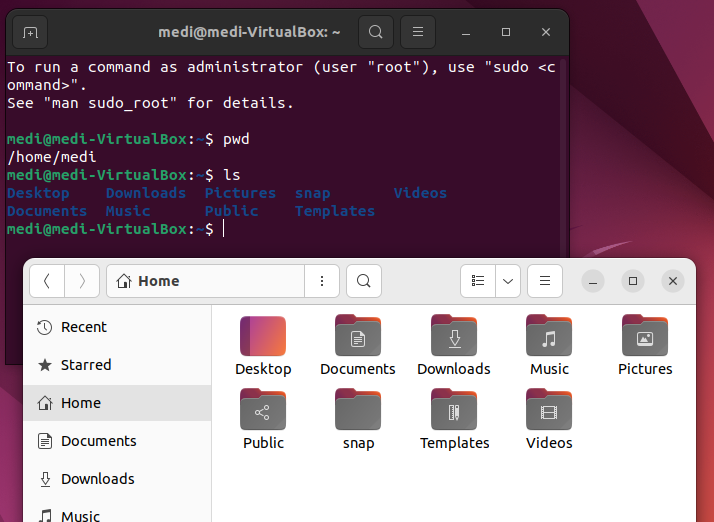   

3. `touch` - This creates a new file  
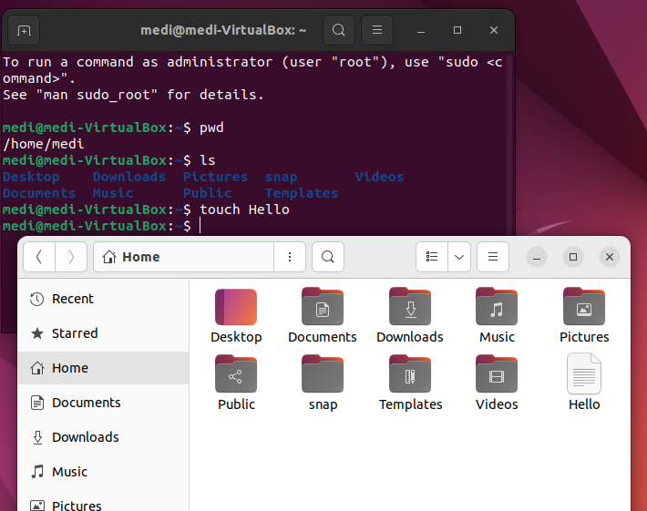  

4. `cat` - This shows you the content of a specified file, The tab button can be used as a shortcut method to specify which file you would like to choose 
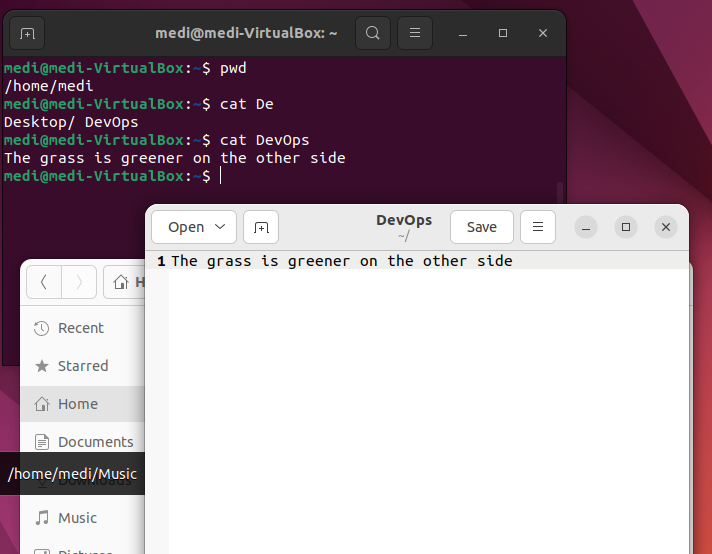    

5. `clear` - Can be used to clear the terminal, can also use ctrl + l     

6. `tail` - Used to display last section of file 
   

7. `head` - Used to display first section of file 
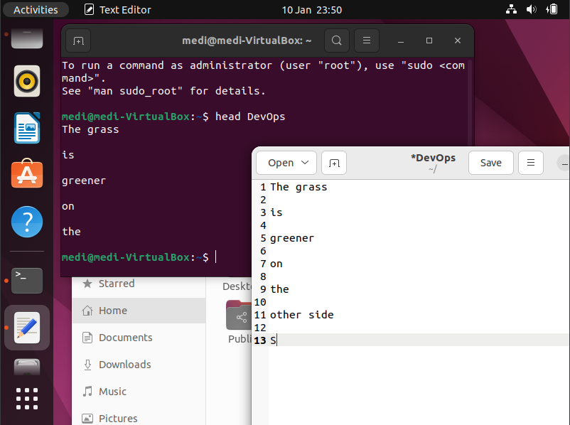   

8. `which` - Shows you where a command is stored     
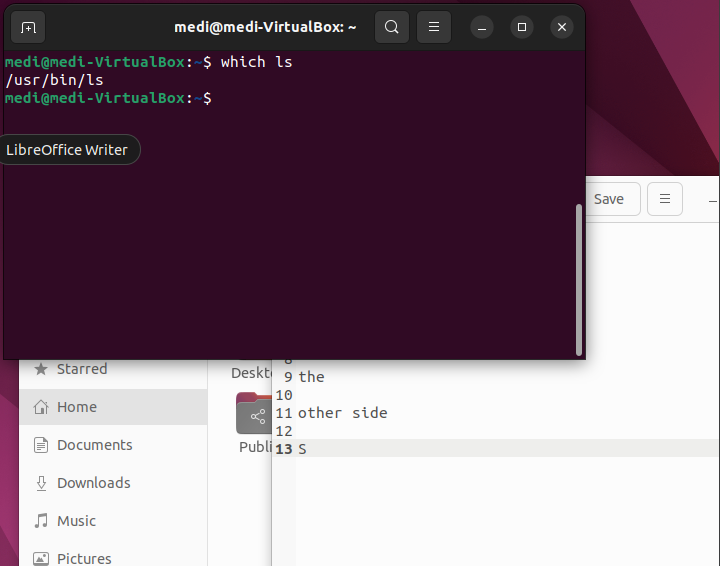  

9. `info` and `man` - Gives you information on the function of a particular command  
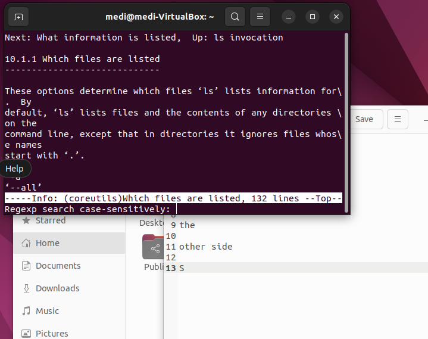   

10. `mkdir` -  Used to create a new directory, Up arrow button can also be used to bring back the previous command     
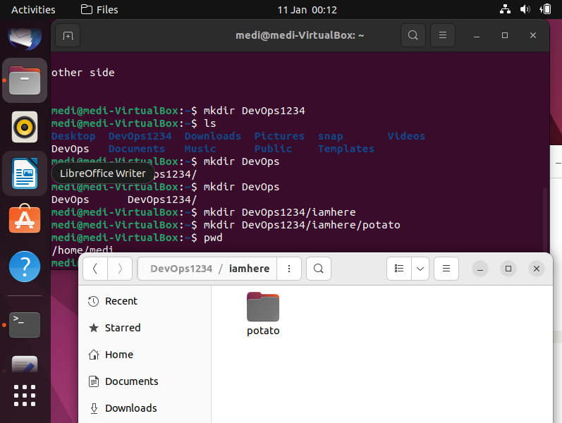   

11. `cd` - This is used to change the directory you are currently working in 
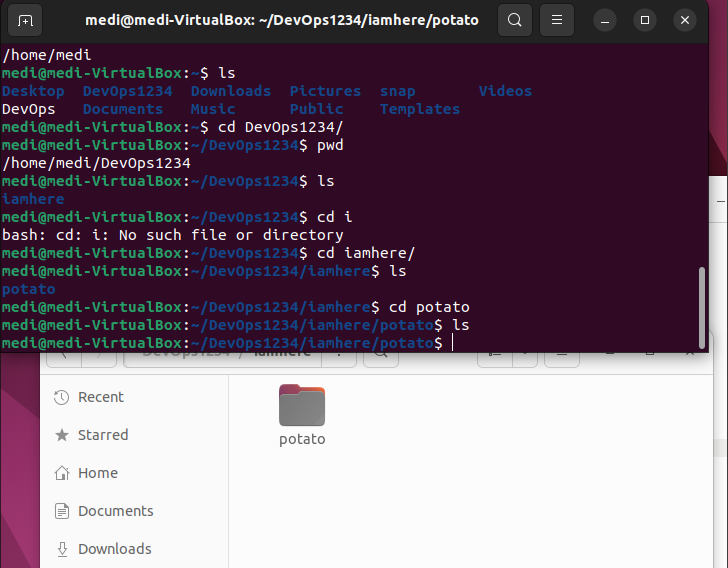   

 `cd -` - Takes you back to the last directory you were in, alternatively you can copy and past directory past after 'cd' command  
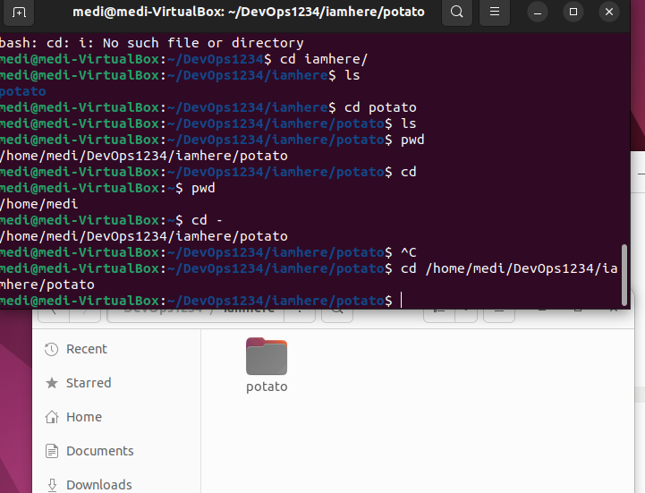    

 12. `rmdir` - Used to remove a directory 
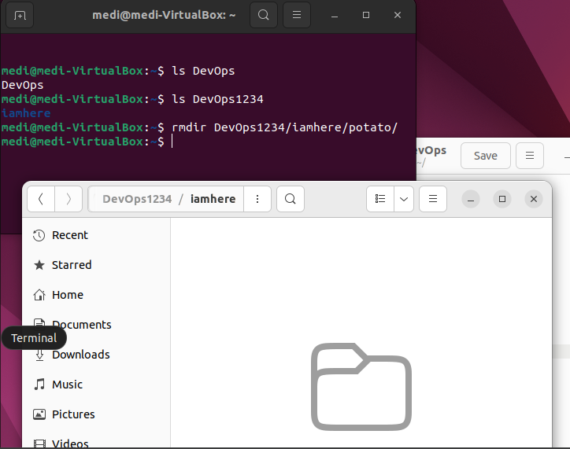    

 13. `rm` - Used to remove   
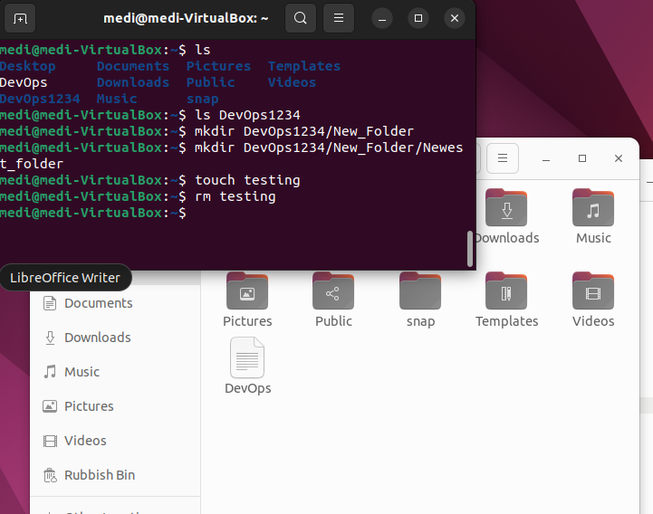 

 14. `cp` - Used to copy   
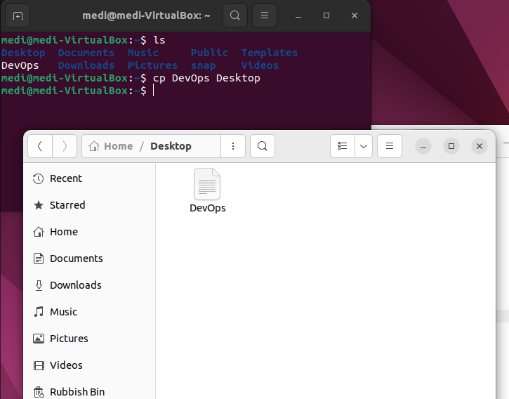 

 15. `mv` - Used to move or rename   
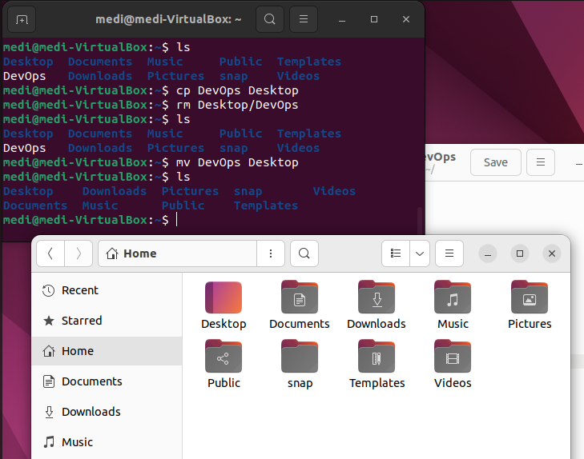 
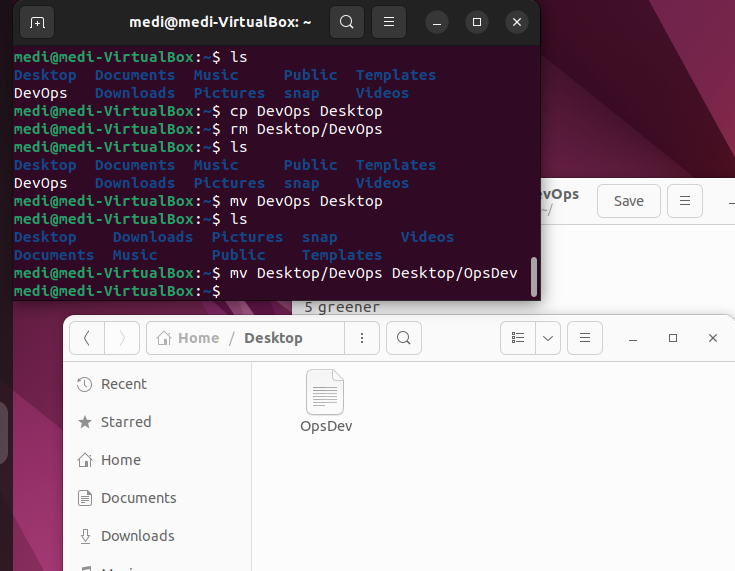 

 16. `echo` - This is used to return what you tell it to 
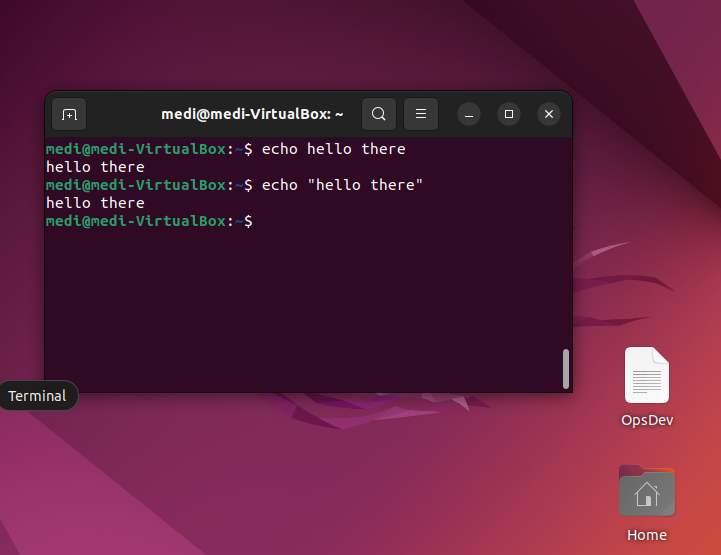  

 Variables are used to assign value to an unknown, "Name" = varible, "Medi" = value
 The "$" sign is used to reference a variable 
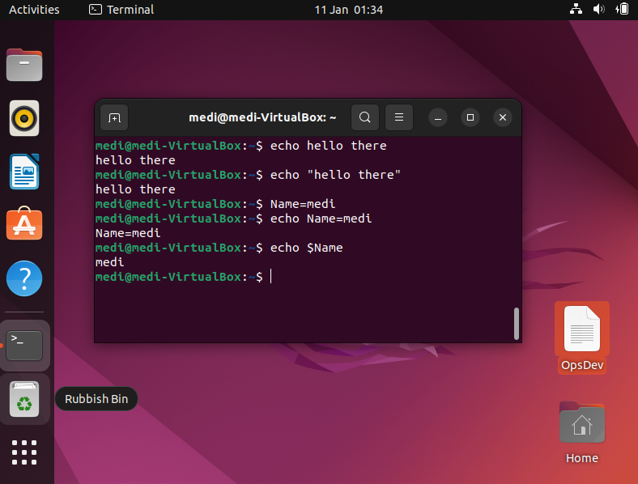

 ## Flags    
1. `ls -l` - Lists files in directory with more information 
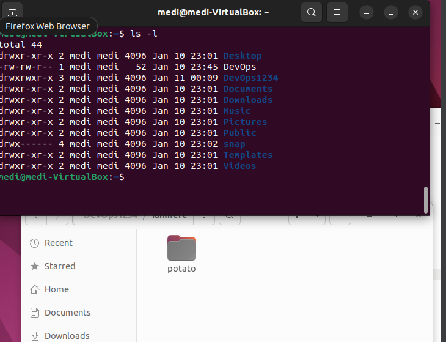   

2. `ls -a` - Includes . files in directory list 
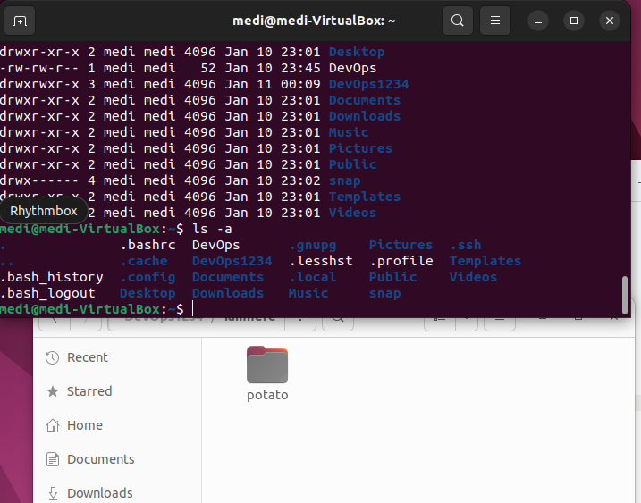   

3. `ls -la` - Combination of previous flags  
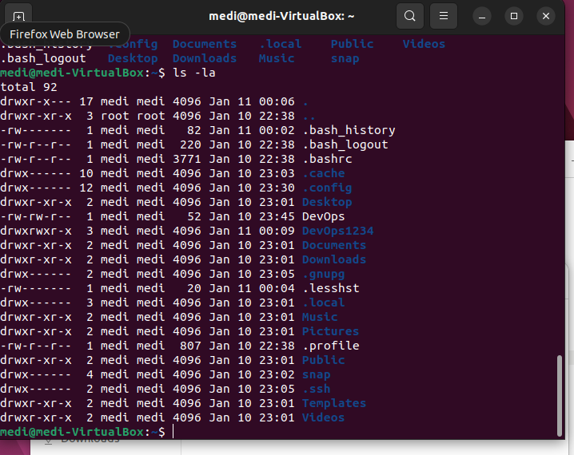  

4. `rm -r` - Allows you to remove directories recursively    
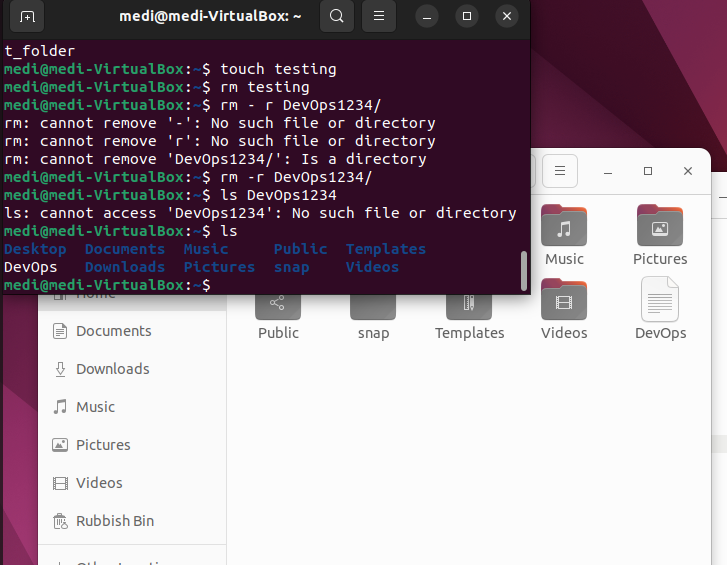   
