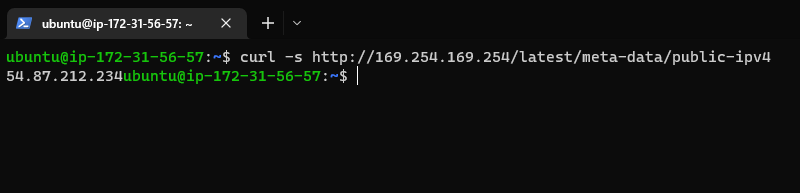

# Connecting to EC2 terminal
First step taken was to create a Linux Server in the Cloud using command `ssh -i <private-key-name>.pem ubuntu@<Public-IP-address>`

   

# Installing Apache and updating the firewall
Next we install Apache via Ubuntu's package manager using commands `sudo apt update` and `sudo apt install apache2`  
You can check if Apache2 is running as a service in Ubuntu using `sudo systemctl status apache2` 

   

We then need to make sure our server is running and available locally, we can do this using the following command `curl http://localhost:80` or `curl http://127.0.0.1:80`

  

We now must check and see if our Apache HTTP Server can respond to requests from the internet, this can be  
done by opening a web browser and trying to access this url: http://< Public-IP-Address >:80 -> The Public IP Address can be found in AWS Web console or by using the command `curl -s http://169.254.169.254/latest/meta-data/public-ipv4`   

  

The following page will show if web server is correctly installed and accessible through the firewall 

  

# Installing MySQL   
We now need a database management system to store and manage data for our website in a relational database. MySQL is a commonly used relational DBMS used within PHP environments 

To acquire and install software use the following command `sudo apt install mysql-server`  

  

Next we must log in to the MySQL console using `sudo mysql` 

  

We then set a password for the root user using mysql_native_password as default authentication method, user's password is defined as PassWord.1 command: `ALTER USER 'root'@'localhost' IDENTIFIED WITH mysql_native_password BY 'PassWord.1';` , We can exit the MySQL shell using `mysql> exit` can alternatively use `\q` 

  

Start the interactive script with command `sudo mysql_secure_installation` 

 

To test if you are able to log into the MySQL console use `sudo mysql -p` 

  

# Installing PHP  

PHP is used to process code to display dynamic content to the end user. We will need to install the following packages "php", "php-mysql" - a PHP module that lets PHP communicate with MySQL-based databases and "libapache2-mod-php" - allows Apache to handle PHP files.

These can all be installed at once using `sudo apt install php libapache2-mod-php php-mysql` the following command `php -v` can be used to confirm our PHP version 

  

# Creating a virtual host for your website using Apache

First step is to create a directory for the domain we are trying to set up "projectlamp" by using `sudo mkdir /var/www/projectlamp` we can then assign ownership of the directory with the current  
system user with the command `sudo chown -R $USER:$USER /var/www/projectlamp`   

  

Vi or Vim (a command-line editor) can now be used to create and open a new configuration file in Apache's  
"sites-available" directory `sudo vi /etc/apache2/sites-available/projectlamp.conf`  

Once the new blank file has been created we can now paste in the bare-bones configuration by hitting "i" on the keyboard to enter insert mode:
`<VirtualHost *:80>
    ServerName projectlamp
    ServerAlias www.projectlamp 
    ServerAdmin webmaster@localhost
    DocumentRoot /var/www/projectlamp
    ErrorLog ${APACHE_LOG_DIR}/error.log
    CustomLog ${APACHE_LOG_DIR}/access.log combined
</VirtualHost>` 

   

To save and close file we must press "Esc" -> Type ":" -> Type "wq" (w for write, q for quit) -> press "Enter" to save file. We can then use `sudo ls /etc/apache2/sites-available` to show and confirm new file in the "sites-available" directory 

  

To enable the new virtual host we use the command `sudo a2ensite projectlamp` we also need to disable
the pre-installed default website that comes with Apache. This is to prevent Apache's default cconfiguration overwriting our virtual host. This can be done using `sudo a2dissite 000-default`  

   

To confirm our configuration file doesn't contain syntax errors we run `sudo apache2ctl configtest` we can then reload Apache so the changes can come into effect `sudo systemctl reload apache2`  

   

Next step is to create an index.html file in web root /var/www/projectlamp to test our virtual host
works 
`sudo echo 'Hello LAMP from hostname' $(curl -s http://169.254.169.254/latest/meta-data/public-hostname) 'with public IP' $(curl -s http://169.254.169.254/latest/meta-data/public-ipv4) > /var/www/projectlamp/index.html` 

We should now be able to open our website URL using IP adress or by public DNS, the text from the `echo` command we wrote to the index.html file shows us our Apache virtual host is working 

 

# Enable PHP on the website

In order to stop the index.html file taking precedence over the new index.php file we are about to create, we must edit the /etc/apache2/mods-enabled/dir.conf file to change the order index.php file 
is listed within the DirectoryIndex directive 

`sudo vim /etc/apache2/mods-enabled/dir.conf`

`<IfModule mod_dir.c>
        #Change this:
        #DirectoryIndex index.html index.cgi index.pl index.php index.xhtml index.htm
        #To this:
        DirectoryIndex index.php index.html index.cgi index.pl index.xhtml index.htm
</IfModule>`

 
(To remove orignal lines press Esc, :, %, d)  

We then reload Apache so changes can take effect `sudo systemctl reload apache2`  

To test if PHP has been correctly installed and configured on our server we can create a PHP script,
first step is to create a new file named "index.php" in our custom web root folder `vim /var/www/projectlamp/index.php` we must then add the text below inside the file.

"<?php
phpinfo();" 

 

To confirm if our PHP installation is working as expected we should see the following after refreshing the page 

 

It is best practice to remove the php file we have created as this contains sensitive information about our PHP
environment and Ubuntu server, we can do this using `sudo rm /var/www/projectlamp/index.php`  