In this project we will be configuring Nginx as a Load Balancer and Registering a new domain name and configuring secured connection using SSL/TLS certificates

# Configuring Nginx as a load balancer 

First step is to create a new EC2 Ubuntu VM named "Nginx LB" 

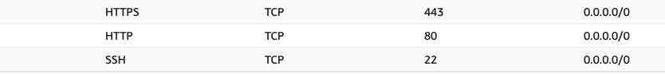
*Note: We must open TCP port 80 for HTTP connections and TCP port 443 for secured HTTPS connections* 

After this we update our /etc/hosts file for local DNS with Web Servers' names (e.g. Web1 and Web2) and their local IP addresses 

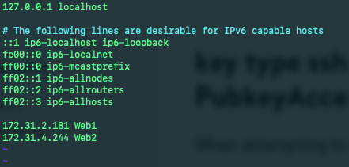

Once the previous step has been completed we can install Nginx by running `sudo apt update` and `sudo apt install nginx` and configure Nginx LB using the Web Servers' names defined in /etc/hosts `sudo vi /etc/nginx/nginx.conf`

```
#insert following configuration into http section

 upstream myproject {
    server Web1 weight=5;
    server Web2 weight=5;
  }

server {
    listen 80;
    server_name www.domain.com;
    location / {
      proxy_pass http://myproject;
    }
  }

#comment out this line
#       include /etc/nginx/sites-enabled/*;
```

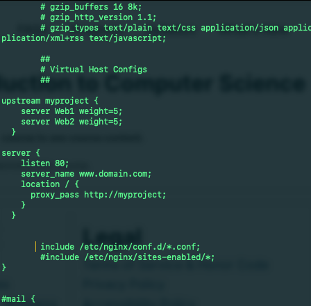


*Tip: Run `sudo systemctl restart nginx` and `sudo systemctl status nginx` to restart Nginx and make sure the service is up and running*

# Registering a new domain name and configuring secured connection using SSL/TLS Certificates 

We will need to register a new domain name using a Domain name registrar (A company that manages reservation of domain names), after this we will assign an Elastic IP to our Nginx LB server and associate our domain name with this IP

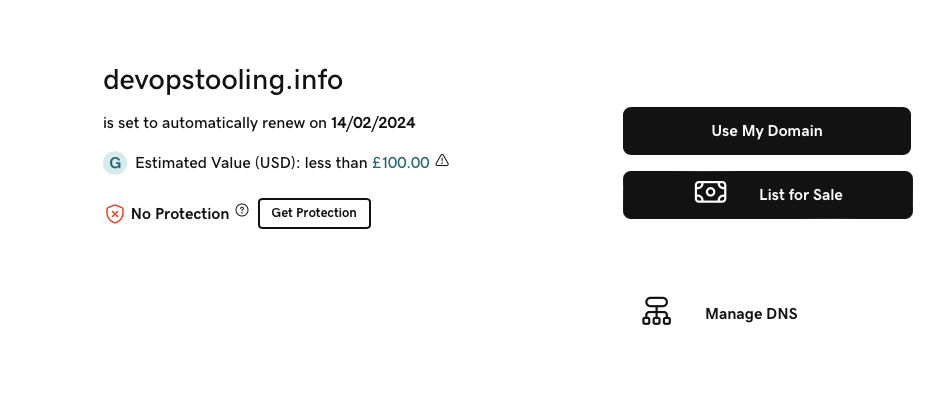

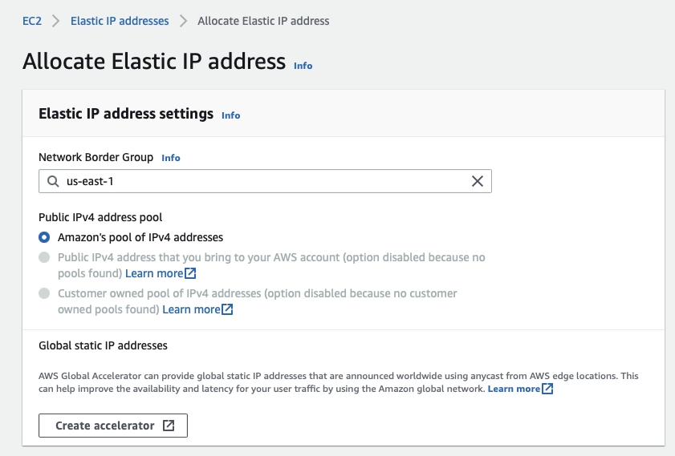

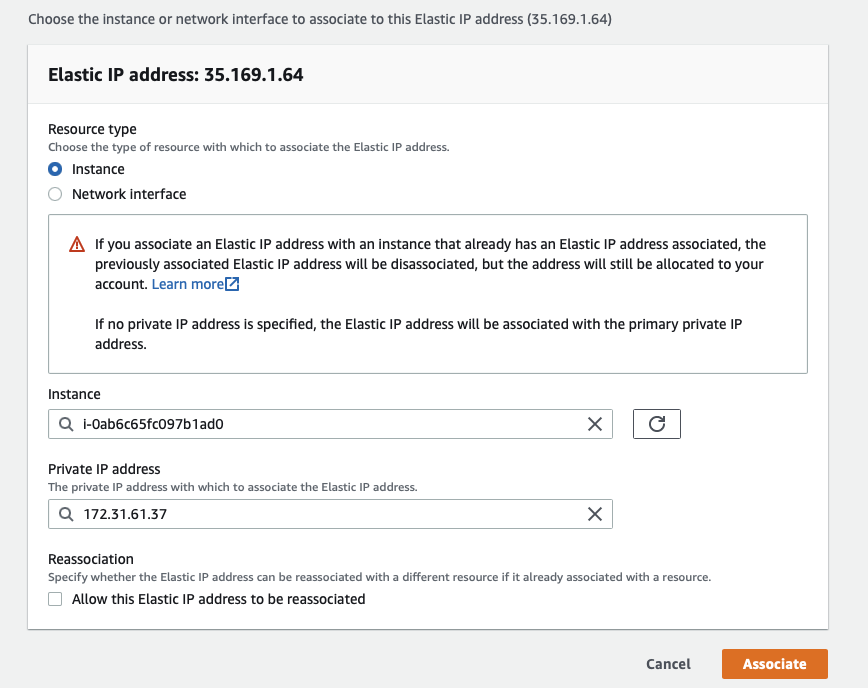

Now we need to update a record in our registrar to point to our Nginx LB using Elastic IP address

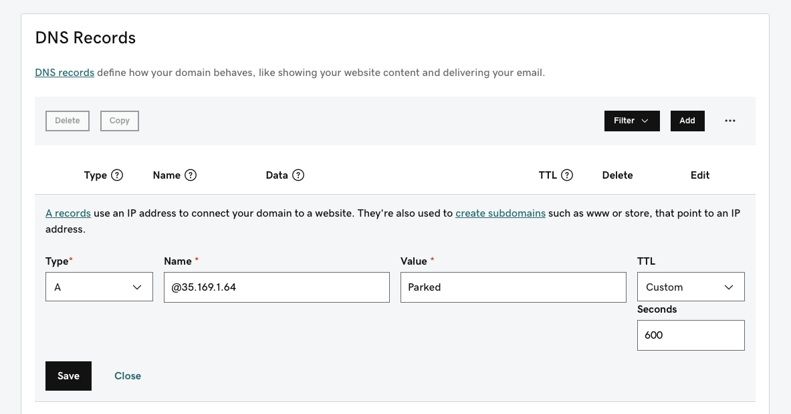

We should now be able to check that our Web Servers can be reached from our browser using our new domain name using HTTP protocol "http://<your-domain-name.com>"

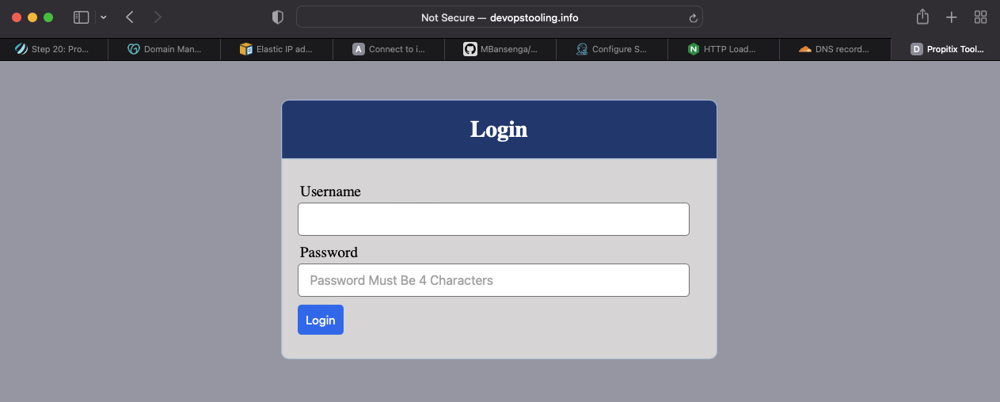

Next step is to configure Nginx to recognise our new domain name by updating our nginx.conf file with `server_name www.<your-domain-name.com>` instead of `server_name www.domain.com`

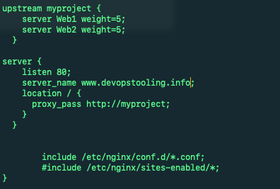

Now we must install certbot and request for an SSL/TLS certificate, first step is to make sure snapd service is active and running `sudo systemctl status snapd` and install certbot `sudo snap install --classic certbot`

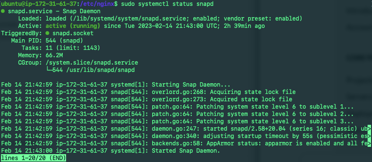

We can now request our certificate by running the following commands and following the instructions `sudo ln -s /snap/bin/certbot /usr/bin/certbot` followed by `sudo certbot --nginx`

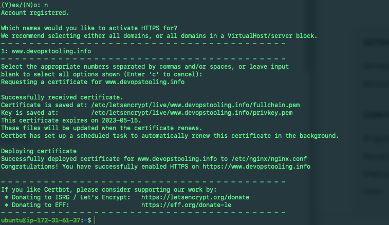

Once complete we can test secured access to our Web Solution by trying to reach "https://<your-domain-name.com>", we should be able to access our website using HTTPS protocol and see a padlock pictogram in our browser's search string. Clicking on the padlock will show us details of the certificate issued for our website.

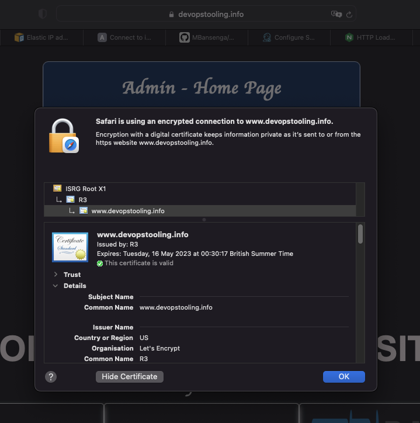

Our final step is to set up periodical renewals of our SSL/TLS certificate. By default, LetsEncrypt certificates are valid for 90 days and it is recommended to renew it at least every 60 days or more frequently. We can test the renewal command in "dry-run" mode `sudo certbot renew --dry-run`

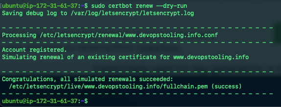

It is best practice to have a scheduled job to run the `renew` command periodically. To do this we can configure a cron job to run the command twice a day, edit the crontab file with the following command `crontab -e` and add the following line `* */12 * * *   root /usr/bin/certbot renew > /dev/null 2>&1` 

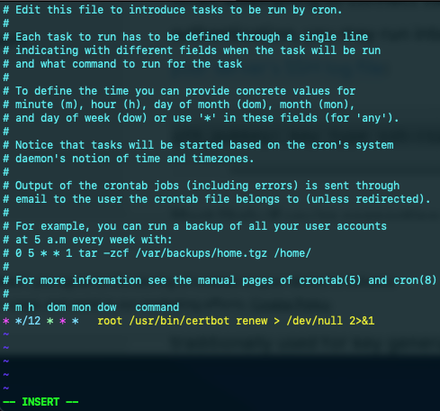


