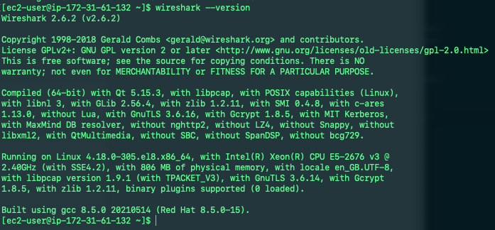

This project will make use of Ansible configuration management to automate our projects 7 to 10. We will also become confident at writing code using declarative language such as YAML.

# Installing and configuring Ansible on EC2 instance

We will be using our Jenkins EC2 instance to run playbooks, we will rename this instance "Jenkins-Ansible" after this we must create a new repository on our GitHub account named
"ansible-config-mgt" 


Next install Ansible `sudo apt update && sudo apt install ansible -y` and check our Ansible version by running `ansible --version` 


We must now configure our Jenkins build to save our repository content every time we change it, this will solidify our Jenkins configuration skills acquired in Project 9

1. Create a new freestyle project "ansible" in Jenkins and point it to our ansible-config-mgt repo 


2. Configure Webhook in our GitHub and set webhook to trigger "ansible" build


3. Configure a Post-build job to save all (**) files like we did in project 9


After these steps we can test our setup by making some changes to our README.MD file, we need to make sure that builds start automatically and Jenkins saves the files in the following folder

`ls /var/lib/jenkins/jobs/ansible/builds/<build_number>/archive/` 


*Note: Every time we stop/start your Jenkins-Ansible server – we have to reconfigure GitHub webhook to a new IP address, in order to avoid it, it makes sense to allocate an Elastic IP to our Jenkins-Ansible server (we have done it before to our LB server in Project 10). Note that Elastic IP is free only when it is being allocated to an EC2 Instance, so do not forget to release Elastic IP once we terminate our EC2 Instance.*

#  Preparing our development environment using Visual Studio Code

We will be required to write some codes and we shall have proper tools that will make our coding and debugging comfortable, we will need an Integrated development environment (IDE) or Source-code Editor, Visual Studio Code is a free and universal editor that we will be using in this project. 

Before we move on to our next step we must configure our VSC to connect to our newly created GitHub repository, we must then clone down our ansible-config-mgt repo to our Jenkins-Ansible instance `git clone <ansible-config-mgt repo link>`


# Beginning Ansible development

In our ansible-config-mgt GitHub repository we must create a new branch that will be used for development of a new feature. Once this is complete we can then checkout the feature branch to our local machine and start building our code and directory structure.


Next we must create two directories, "playbooks" and "inventory" (playbooks - will be used to store all our playbook files, inventory - will be used to keep our hosts organised)


In the playbooks folder we will need to create our first playbook named "common.yml", and in the inventory folder we must create an inventory file for each environment (dev.yml, staging.yml, uat.yml and prod.yml)


# Setting up an Ansible Inventory

Ansible inventory files define the hosts and groups of hosts upon which commands, modules, and tasks in a playbook operate. We will need to execute linux commands on remote hosts and make sure it is the intended configuration on a particular server that occurs. It is important to have a way to organise our hosts in such an inventory. 

Ansible uses TCP port 22 by default this means it will need to ssh into targetr servers from Jenkins-Ansible host. We can do this using the concept of ssh-agent, we will import our key into ssh-agent with the following commands 

```
eval `ssh-agent -s`
`ssh-add <path-to-private-key>` 
```


Next confirm the key has been added with following command `ssh-add -l` and ssh into our Jenkins-Ansible server using ssh-agent `ssh -A ubuntu@public-ip` 


Now update our inventory/dev.yml with the following code:

```
[nfs]
<NFS-Server-Private-IP-Address> ansible_ssh_user='ec2-user'

[webservers]
<Web-Server1-Private-IP-Address> ansible_ssh_user='ec2-user'
<Web-Server2-Private-IP-Address> ansible_ssh_user='ec2-user'

[db]
<Database-Private-IP-Address> ansible_ssh_user='ec2-user' 

[lb]
<Load-Balancer-Private-IP-Address> ansible_ssh_user='ubuntu'
```


# Creating a common playbook

We can now start giving Ansible instructions on what we need to be performed on all servers listed in our inventory/dev

In our common.yml playbook we will write configuration for repeatable, re-usable, and multi-machine tasks that are common to systems within the infrastructure. We must update our playbooks/common.yml with the following:


*Note: This playbook is divided into two parts, each of them is intended to perform the same task: install wireshark utility (or make sure it is updated to the latest version) on our RHEL 8 and Ubuntu servers. It will perform this as a root user with the respective package managers yum and apt.*

# Update GIT with the latest code

We now need to push all the changes made locally (in our directories and files on our machine) to GitHub. Now that we have a seperate branch, we will need to know how to raise a Pull Request (PR) to get our branch peer reviewed and merged to the master branch.

First we must use the following git commands to add, commit and push our branch to GitHub:

```
git status

git add <selected files>

git commit -m "commit message"
```


Now we must create a PR, we must act like another developer for a second and act as a reviewer, if we are happy with our new feature development merge the code to the master branch. We can headback to our terminal, checkout from the feature branch into the master, and pull down the latest changes.


Once our code changes appear in the master branch, Jenkins will do its job and save all the build artifacts to `/var/lib/jenkins/jobs/ansible/builds/<build_number>/archive/` directory on our Jenkins-Ansible server


# Running first Ansible test

It is now time to execute the ansible-playbook command and verify if our playbook actually works:

```
ansible-playbook -i /var/lib/jenkins/jobs/ansible/builds/2/archive/inventory/dev.yml /var/lib/jenkins/jobs/ansible/builds/2/archive/playbooks/common.yml
```


We can go to each of the servers and check if wireshark has been installed using the following commands
`which wireshark` or `wireshark --version` 



