For this project we will continue working with our ansible-config-mgt repository and make some improvements to our code. We will need to refactor our Ansible code, create assignments, and learn how to use the imports functionality. Imports allow us to effectively re-use previously created playbooks in a new playbook - it allows us to organise our tasks and reuse them when needed. 

# Code Refactoring

Refactoring is making changes to the source code without changing expected behaviour of the software. The main goal of refactoring is to enhance code reliablity, increase maintainability and extensibility, reduce complexity and add proper comments without affecting the logic.

In our case we will move things around a little bit in the code, but the overrall state of the infrastructure will remain the same.

# Jenkins job enhancement

We must first make some changes to our Jenkins job. Currently every new change in the codes creates a seperate directory which is not convinient for when we want to run some commands from one place. It also consumes space on Jenkins server with each subsequent change. We can improve this by introducing a new Jenkins project/job we will require the "Copy Artifact" plugin 

First step is to go to our Jenkins-Ansible server and create a new directory called "ansible-config-artifact" this will be used to store all artifacts after each build `sudo mkdir /var/lib/jenkins/ansible-config-artifact` we must then change permissions to give Jenkins access to save files here using `chmod -R 0777 /var/lib/jenkins/ansible-config-artifact` 

Next go to Jenkins web console -> Manage Jenkins -> Manage Plugins -> on the "Available" tab search for "Copy Artifact" and install this plugin without restarting Jenkins

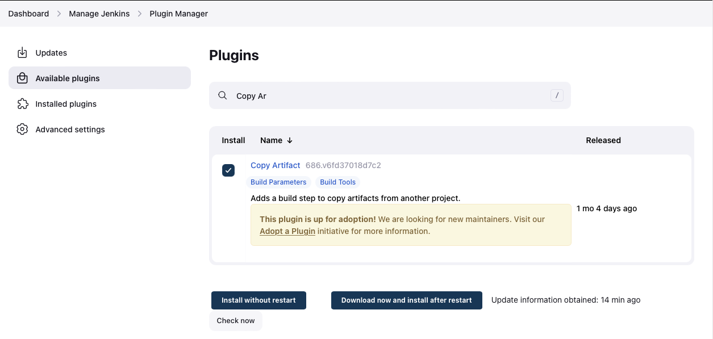

Now we must create a new freestyle project named "save_artifacts", we must also configure the project to be triggered by completion of our existing ansible project

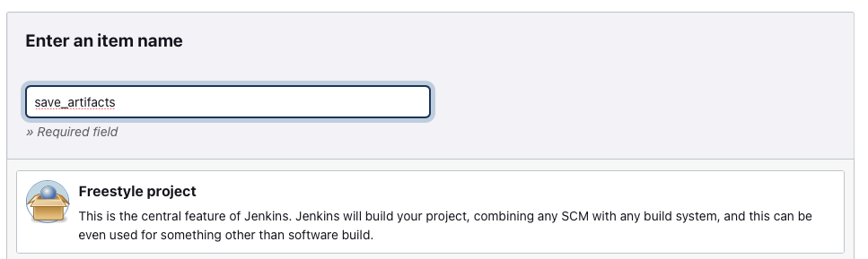

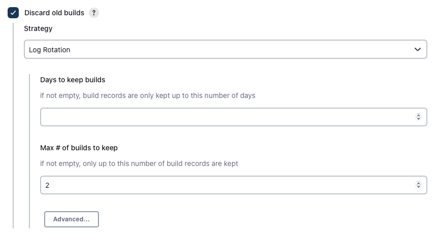

*Note: We can configure number of builds to keep in order to save space on the server, for example, we might want to keep only last 2 or 5 build results. We can also make this change to your ansible job.*

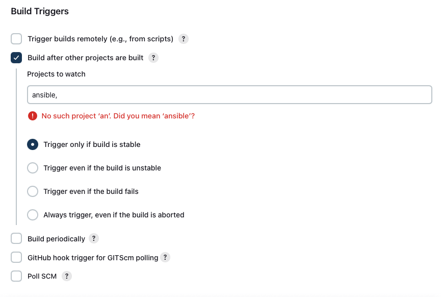

We will use our save_artifacts project to save artifacts into the /var/lib/jenkins/ansible-config-artifact directory. We can do this by creating a build step and choosing "Copy artifacts from other project", specify ansible as a source project and /var/lib/jenkins/ansible-config-artifact as a target directory.

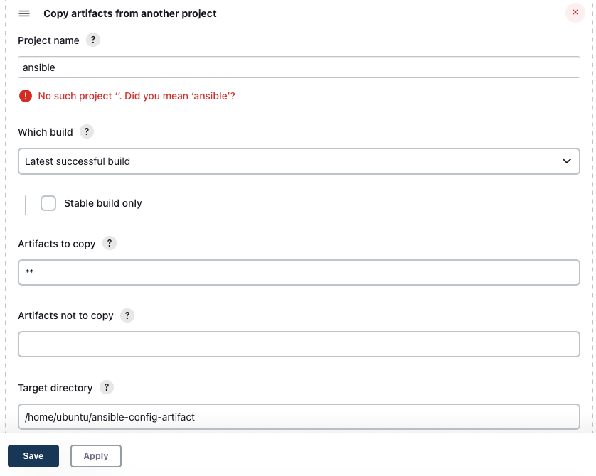

To test our set up we can make changes in our README.MD file inside our ansible-config-mgt repository, if both Jenkins jobs have completed one after another we should see our files inside the /var/lib/jenkins/ansible-config-artifact directory and it will be updated with every commit to our master branch.

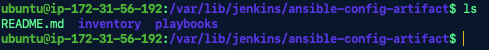

# Refactoring Ansible code by importing other playbooks into site.yml

Before we start to refactor the codes we must ensure that we have pulled down the latest code from our master branch, and create a new branch named "refactor"

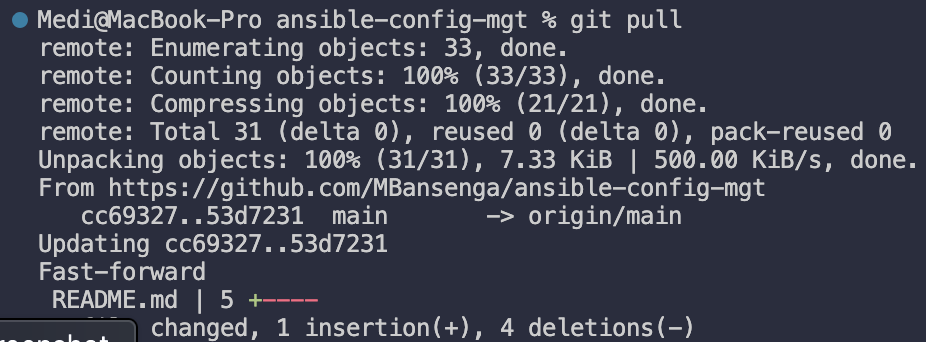

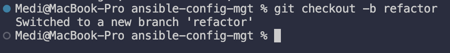

We can use refactoring to break tasks up into different files in order to organise complex sets of tasks and reuse them. In project 11 we wrote all our tasks in a single playbook common.yml. We will see code re-use in action by importing other playbooks.

First we must create a new file named "site.yml" within our playbooks folder, this file will be considered as an entry point into the entire infrastructure configuration with other playbooks included as a reference.

We must then create a new folder in root of the repository named "static-assignments" - this folder is where all other children playbooks will be stored for easy organisation of our work.

Once complete we can move common.yml into the static-assignments folder, and inside site.yml we can import common.yml playbook:

```
---
- hosts: all
- import_playbook: ../static-assignments/common.yml
```
*The code above uses built in import_playbook Ansible module.*

Our folder structure should look like this:

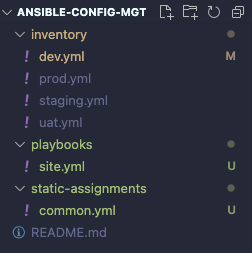

We will need to apply some tasks to our dev servers and wireshark is already installed, we can create another playbook under static-assignments and name it common-del.yml. In this playbook we will configure the deletion of wireshark utility:

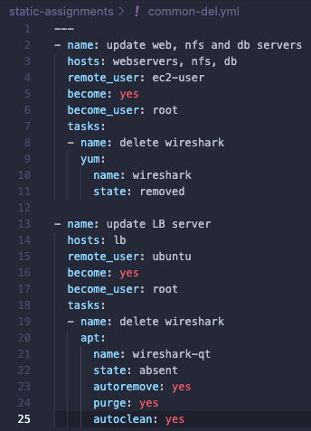

Next update site.yml with `- import_playbook: ../static-assignments/common-del.yml` instead of `common.yml` and run it against our dev servers:

```
cd /home/ubuntu/ansible-config-mgt/

ansible-playbook -i inventory/dev.yml playbooks/site.yml
```

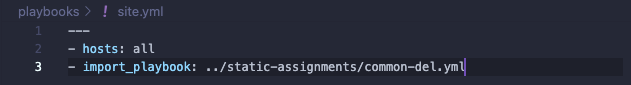 

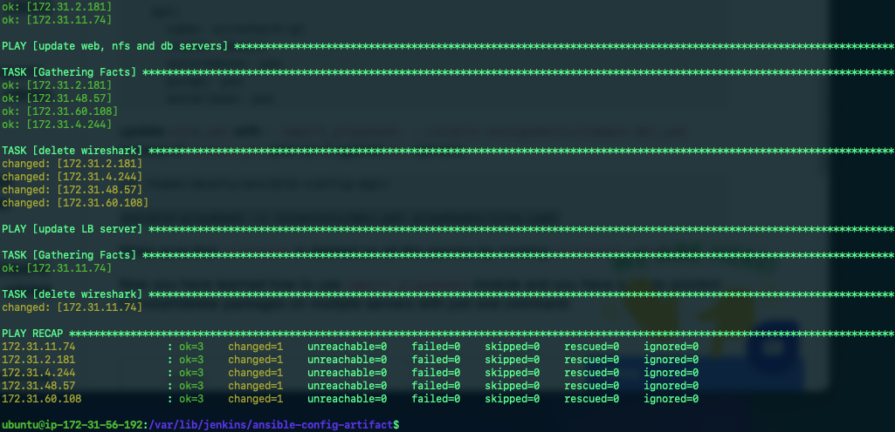 

We can make sure wireshark is deleted on all servers by running `wireshark --version`

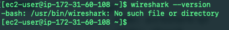 

# Configuring UAT Webservers with a role 'Webserver' 

We have a nice and clean dev environment so we can now configure 2 new Web Servers as UAT. We could write tasks to configure Web Servers in the same playbook but this would be too messy, instead, we will use a dedicated role to make our configuration reusable. 

First we must launce 2 new EC2 instances using RHEL 8 image, we will use these as our UAT servers (Web1-UAT & Web2-UAT)

We must then create a directory called `roles/` relative to the playbook file or in `/etc/ansible` directory -> the roles structure should look like the screenshot below 

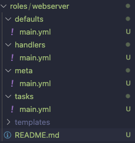 

Next step is to update our inventory `ansible-config-mgt/inventory/uat.yml` file with IP addresses of our 2 UAT Web servers

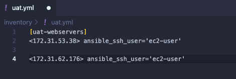 

In the /etc/ansible/ansible.cfg file we must uncomment the `roles_path` string and provide a full path to our roles directory `roles_path = /var/lib/jenkins/ansible-config-artifact/roles` this will allow Ansible to know where to find configured roles 

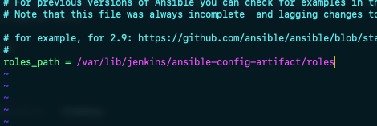 

Now we must start adding some logic to the webserver role. We must go into our tasks directory, within the main.yml file we can start writing configuration tasks to do the following:

1. Install and configure Apache (httpd service)
2. Clone Tooling website from GitHub https://github.com/<your-name>/tooling.git.
3. Ensure the tooling website code is deployed to /var/www/html on each of 2 UAT Web servers.
4. Make sure httpd service is started

Our main.yml should consist of the following tasks:

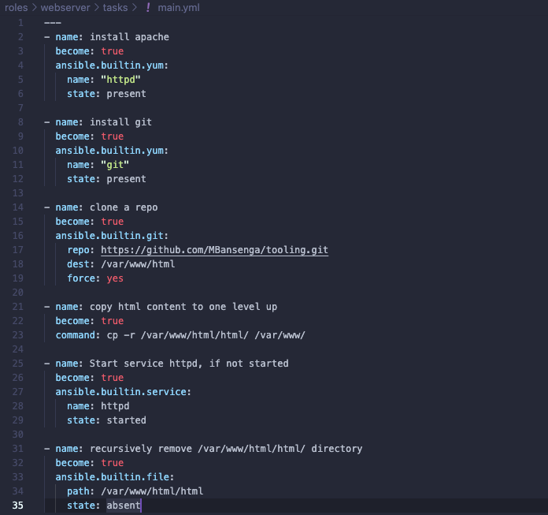 

# Reference ‘Webserver’ role

Within the static-assignments folder, we must create a new assignment for uat-webservers called `uat-webservers.yml`. This is where we will reference the role:

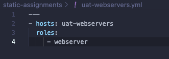

The entry point to our ansible configuration file is the site.yml file. Therefore, we need to refer to our uat-webservers.yml role inside site.yml, our site.yml file should contain the following:

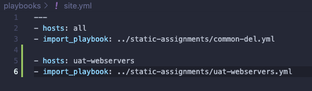

# Commit & Test

We must now commit our changes, create a PR and merge them to the master branch. Once complete we must make sure webhook triggered two consequent Jenkins jobs and copied all files to our Jenkins-Ansible server into the /var/lib/jenkins/ansible-config-artifact directory successfully. 

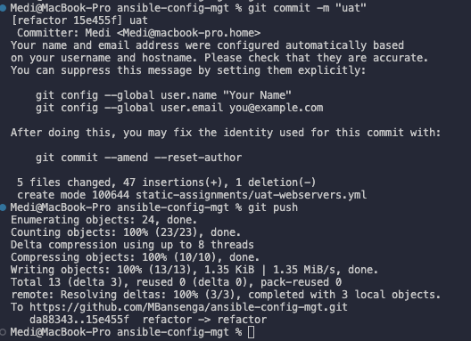

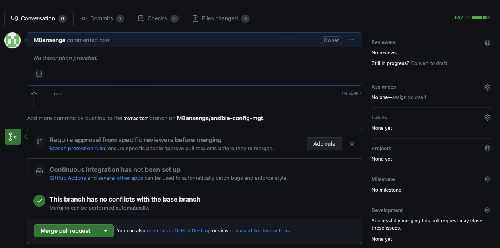

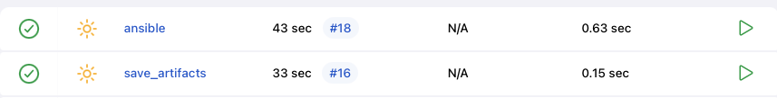

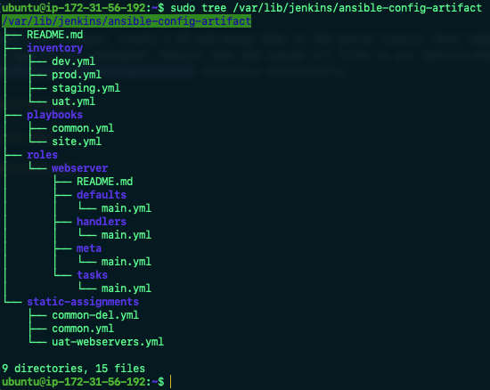

Next we can run the playbook against our UAT inventory to see what happens: 

`ansible-playbook -i /var/lib/jenkins/ansible-config-artifact/inventory/uat.yml /var/lib/jenkins/ansible-config-artifact/playbooks/site.yml`

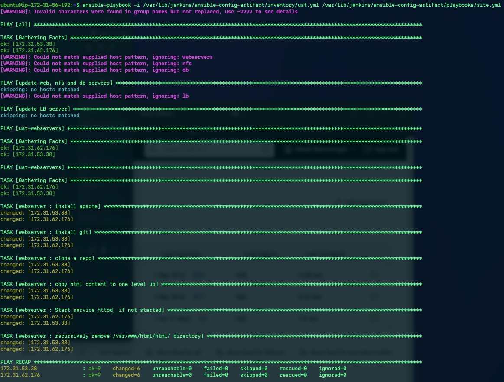

We should be able to see both of our UAT Web Servers configured and we can try to access them from our browser `"http://< Web-UAT-Server-Public-IP-or-Public-DNS-Name >/index.php"` 

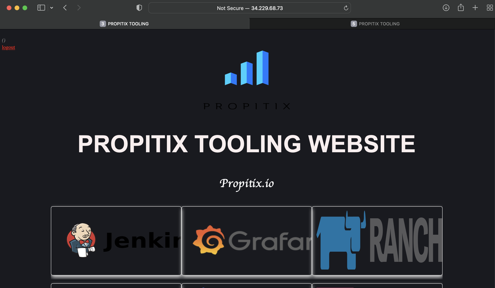


