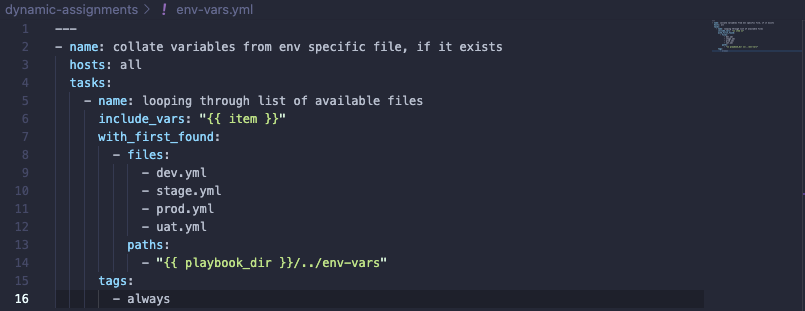
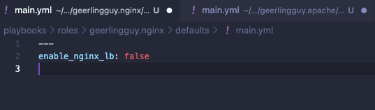

In this project we will continue configuring our UAT servers and learning new Ansible concepts and modules. We will introduce dynamic assignments by using include module. 

# Introducing dynamic assignment into our structure

First we must start a new branch in our GitHub repository called "dynamic-assignments" -> We must then create a new folder named "dynamic-assignments" inside this folder we can then create a new file named "env-vars.yml" (We will instruct site.yml to include this playbook later)

Our GitHub should have the following structure:


We will also need to create a new folder `env-vars` to keep each environment's variables file. In this folder we will create new YAML files which will be used to set variables. Our layout should look like this:


Now we must paste the following instruction into the env-vars.yml file:



# Update site.yml with dynamic assignments

Next we update our site.yml to make use of dynamic assignment:


We can now create a role for MySQL database which should install the MySQL package, create a database and configure users. There are production ready roles that have already been developed by other open source engineers. These roles are also dynamic to accomodate most of Linux flavours. 

In this project we will be using a MySQL role developed by geerlingguy

On our Jenkins-Ansible server make sure git is installed with `git --version` then go to ansible-config-mgt directory and run

```
git init
git pull https://github.com/<your-name>/ansible-config-mgt.git
git remote add origin https://github.com/<your-name>/ansible-config-mgt.git
git branch roles-feature
git switch roles-feature 
```


Inside our `roles` directory we must create our new MySQL role with `ansible-galaxy install geerlingguy.mysql` and rename the folder to `mysql` using `mv geerlingguy.mysql/ mysql` 


Once completed we must read the `README.md` file and edit roles configuration to use the correct credentials for MySQL required for the tooling website 


We can now upload our changes into our Github:

```
git add .
git commit -m "Commit new role files into GitHub"
git push --set-upstream origin roles-feature
```


Once we are satisfied with our codes, we can create a PR and merge to our main branch on GitHub


# Load balancer roles

We can have two roles (Nginx and Apache) which can be used to choose which Load Balancer to use -> To do this we will first use the `ansible-galaxy` command to use roles readily available from the community 


We must now declare a variable in our `defaults/main.yml` file inside our Nginx and Apache roles.
We will name each variable `enable_nginx_lb` and `enable_apache_lb` respectively, we must also set both values to `false`



After this we must also declare another variable in both roles `load_balancer_is_required` and set its value to `false`


In our assingment and site.yml files we must input the following:

`loadbalancers.yml`
```
- hosts: lb
  roles:
    - { role: nginx, when: enable_nginx_lb and load_balancer_is_required }
    - { role: apache, when: enable_apache_lb and load_balancer_is_required }
```


`site.yml`
```
   - name: Loadbalancers assignment
       hosts: lb
         - import_playbook: ../static-assignments/loadbalancers.yml
        when: load_balancer_is_required 
```


We must also configure our `tasks/main.yml` file for both roles 


Next we must input the following in our templates folder:


Finally we can make use of our `env-vars/uat.yml` file to define which lb to use in UAT
environment by setting respective environmental variable to `true`, we can test this by updating our inventory for each env and run Ansible against each environment.


