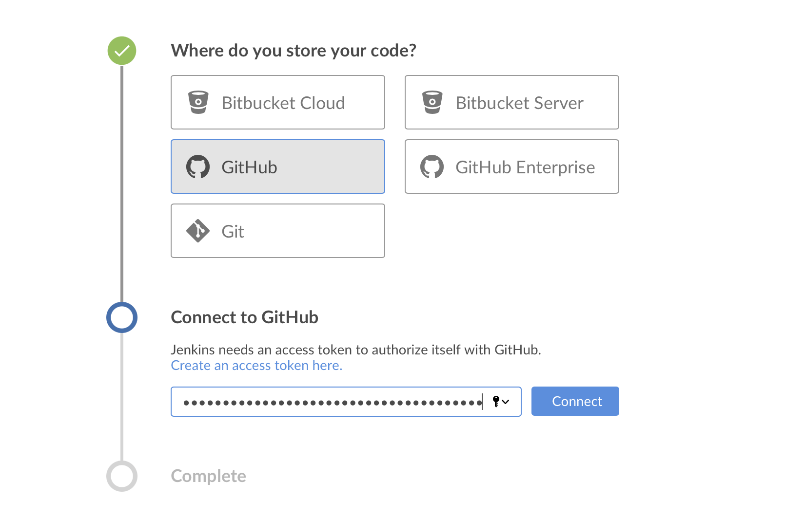
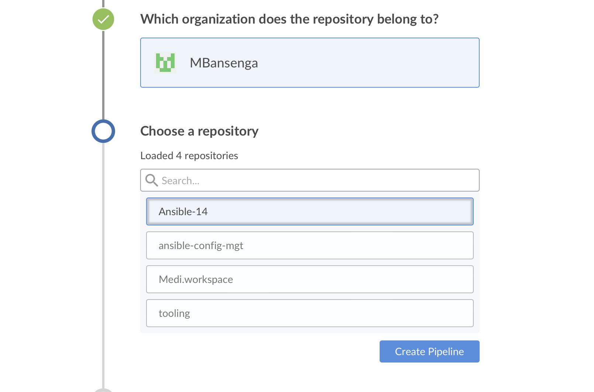

This project will help us solidify our knowledge and give us hands on experience around the entire concept of CI/CD from an applications perspective. 

# Simulating a typical CI/CD pipeline for a PHP based application

In this project we will be creating a pipeline that simulates continuous integration and delivery. The `Tooling` and `TODO` web applications are based on an intepreted (scripting) language, this means they can be deployed directly onto a server and will work without compiling the code to a machine language.

We will be using Ansible `uri module` instead of downloading directly from git for releases. This is because it would be challenging to package and version the software for different releases.

We will be creating the servers required for each environment we are working on at the moment. First we will focus on the `Ci`, `Dev` and `Pentest` environments

Our Ansible Inventory should look like this:


`CI` inventory file:

```
[jenkins]
<Jenkins-Private-IP-Address>

[nginx]
<Nginx-Private-IP-Address>

[sonarqube]
<SonarQube-Private-IP-Address>

[artifact_repository]
<Artifact_repository-Private-IP-Address>
```

`Dev` inventory file:

```
[tooling]
<Tooling-Web-Server-Private-IP-Address>

[todo]
<Todo-Web-Server-Private-IP-Address>

[nginx]
<Nginx-Private-IP-Address>

[db:vars]
ansible_user=ec2-user
ansible_python_interpreter=/usr/bin/python

[db]
<DB-Server-Private-IP-Address>
```

`pentest` inventory file

```
[pentest:children]
pentest-todo
pentest-tooling

[pentest-todo]
<Pentest-for-Todo-Private-IP-Address>

[pentest-tooling]
<Pentest-for-Tooling-Private-IP-Address>
```

Important notes:

1. `pentest:children` is an Ansible concept called group_vars -> with this we can declare and set variables for each group of servers created in the inventory file
2. The `db` group uses a RedHat/Centos Linux distro while the others are based on Ubuntu. This means the user required for connectivity and path to python interpreter are different.

# Ansible roles for CI Environment 

We will need to add two more roles to ansible:

1. `SonarQube` - An open-source platform developed by SonarSource for continuous inspection of code quality. Used to perform automatic reviews with static analysis of code to detect bugs, code smells (any code that may indicate a deeper problem), and security vulnerabilities. 

2. `Artifactory` - A product created by JFrog that serves as a binary repository manager. The binary repository is a natural extension to the source code repo, in which the outcome of your build process is stored. Can be used for certain other automation.


For this project we will be running Ansible from Jenkins UI. 

To do this we must:

1. Navigate to Jenkins URL
2. Install & Open Blue Ocean Jenkins Plugin 
3. Create a new pipeline 


4. Select GitHub and Login to GitHub & Generate an access token, then Copy & Paste and connect





5. Create a new pipeline and click on Administration to exit the Blue Ocean console (Ignore the Jenkinsfile prompt, we will create this ourselves)




We can now create our Jenkinsfile by creating a new directory `deploy` and starting a new file inside the directory 

Add the following code snippet to start building the Jenkinsfile gradually. The pipeline currently has one stage called `Build` we are using the `shell script` module to echo `Building stage`


Next we go back into the Ansible pipeline in Jenkins and select configure -> Scroll down to Build configuration section and specify the Jenkinsfile location `deploy/Jenkinsfile` -> Once completed go back to the pipeline and select "Scan repository now"


This triggers a build where we can see the effect of our basic Jenkinsfile configuration going through the console output of the build. 

We will now try triggering the build again from Blue Ocean interface.

Click on the play button against the branch:


Next step is to create a new git branch named `feature/jenkinspipeline-stages`, we currently have only the `Build` stage so we will add another stage called `Test`. Copy & Paste the following code snippet below and push the new changes to Github


For the new branch to show up in Jenkins we will need to tell Jenkins to scan the repository, after refreshing the page both branches will start building automatically. We can go into Blue Ocean and see both branches there too


In Blue Ocean, we can now see the a new step our Jenkinsfile has caused in the pipeline launch build


Now we can do the following to end up with a successful pipeline on our main branch in blue ocean

```
1. Create a pull request to merge the latest code into the main branch
2. After merging the PR, go back into your terminal and switch into the main branch.
3. Pull the latest change.
4. Create a new branch, add more stages into the Jenkins file to simulate below phases. (Just add an echo command like we have in build and test stages)
   1. Package 
   2. Deploy 
   3. Clean up
5. Verify in Blue Ocean that all the stages are working, then merge your feature branch to the main branch
6. Eventually, your main branch should have a successful pipeline like this in blue ocean
```


# Running Ansible Playbook From Jenkins

To get our Ansible deployment to work we must follow the first 3 steps:

1. Install Ansible on Jenkins


2. Install Ansible plugin in Jenkins UI


3. Create a Jenkinsfile from scratch (We can just clear our existing file)

Jenkins will need to export the `ANSIBLE_CONFIG` environment variable. We can put the `.ansible.cfg` file alongside `Jenkinsfile` in the deploy directory. Anyone can now easily identify that everything in there relates to deployment. We can then use the Pipeline syntax tool in Ansible to generate the syntax to create environment variables to set.


