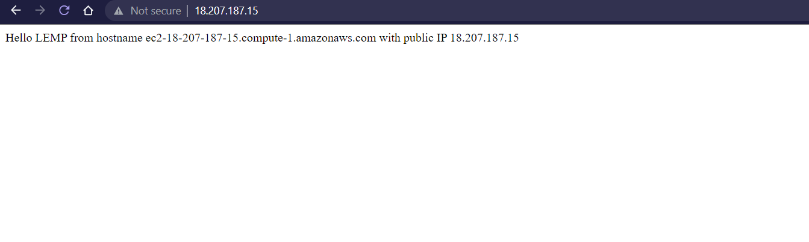

# Installing the NGINX web server  
In our last project we connected to our EC2 instance using the Terminal, in this project 
we use Git Bash instead which does not require conversion of .pem key to .ppk, we use the following
command `ssh -i <Your-private-key.pem> ubuntu@<EC2-Public-IP-address>`  

 

We then install Nginx (high-performance webserver) using the apt package manager, we use the following commands `sudo apt update` and `sudo apt install nginx` we can then check if Niginx
was installed sucessfully in Ubuntu using `sudo systemctl status nginx`  

 

We then need to make sure our server is running and available locally, we can do this using the following command `curl http://localhost:80` or `curl http://127.0.0.1:80`

 

We now must check and see if our Nginx server can respond to requests from the internet, this can be  
done by opening a web browser and trying to access this url: http://< Public-IP-Address >:80 -> The Public IP Address can be found in AWS Web console or by using the command `curl -s http://169.254.169.254/latest/meta-data/public-ipv4`   

The following page will show if our web server is now correctly installed and accessible through
the firewall  

  

# Installing MySQL  
We now need a database management system to store and manage data for our website in a relational database. MySQL is a commonly used relational DBMS used within PHP environments 

To acquire and install software use the following command `sudo apt install mysql-server` and log in
to the MySQL console using `sudo mysql` 

  

We then set a password for the root user using mysql_native_password as default authentication method, user's password is defined as PassWord.1 command: `ALTER USER 'root'@'localhost' IDENTIFIED WITH mysql_native_password BY 'PassWord.1';` , We can exit the MySQL shell using `mysql> exit` can alternatively use `\q` 

  

Start the interactive script with command `sudo mysql_secure_installation` 

   

To test if you are able to log into the MySQL console use `sudo mysql -p` and exit using `mysql> exit`  

   

# Installing PHP
Unlike Apache, Nginx requires an external program to handle PHP processing. Because of this we will need to install PHP fastCGI process manager, we will also need php-mysql for communication between PHP and MySQL-based databases. To do this we run `sudo apt install php-fpm php-mysql` 

# Configuring NGINX to use PHP processor 
With Nginx we can create server blocks similar to virtual hosts in Apache which enables the web server to host more than one domain on a single server 

First step is to create a directory for the domain we are trying to set up "projectlemp" by using `sudo mkdir /var/www/projectLEMP` we can then assign ownership of the directory with the current  
system user with the command `sudo chown -R $USER:$USER /var/www/projectLEMP`  

  

We can then use Nano to create and open a new configuration file in Apache's  
"sites-available" directory `sudo nano /etc/nginx/sites-available/projectLEMP`  

Once the new blank file has been created we can now paste in the bare-bones configuration:

```
server {
    listen 80;
    server_name projectLEMP www.projectLEMP;
    root /var/www/projectLEMP;

    index index.html index.htm index.php;

    location / {
        try_files $uri $uri/ =404;
    }

    location ~ \.php$ {
        include snippets/fastcgi-php.conf;
        fastcgi_pass unix:/var/run/php/php7.4-fpm.sock;
     }

    location ~ /\.ht {
        deny all;
    }

}
```

  

After editing we can type ctrl + x, y and ENTER to confirm changes made 

Before reloading we must activate our configuration by linking the config file from Nginx's "sites-enabled" directory using the command `sudo ln -s /etc/nginx/sites-available/projectLEMP /etc/nginx/sites-enabled/` we also test for syntax errors using `sudo nginx -t`  

   

Now we must disable the default Nginx host that is configured to listen to port 80 using `sudo unlink /etc/nginx/sites-enabled/default` we are now ready to reload Nginx with command `sudo systemctl reload nginx` 

We can test to see if our server block works and that our website is up and running by creating an index.html file in the /var/www/projectLEMP directory `sudo echo 'Hello LEMP from hostname' $(curl -s http://169.254.169.254/latest/meta-data/public-hostname) 'with public IP' $(curl -s http://169.254.169.254/latest/meta-data/public-ipv4) > /var/www/projectLEMP/index.html` 

The text from the echo command should appear on our website which we can visit through http://<Public-IP-Address>:80  

     

# Testing PHP with NGINX  
We need to confirm whether Nginx can correctly pass .php files on to our PHP processor, first we must create a test PHP file in our document root using `sudo nano /var/www/projectLEMP/info.php` and paste the following lines into the file

```php
<?php
phpinfo();
``` 

  

We should now be able to access this page using via web browser "http://`server_domain_or_IP`/info.php" the following page should appear 

 

It is best practice to remove the php file we have created as this contains sensitive information about our PHP
environment and Ubuntu server, we can do this using `sudo rm /var/www/your_domain/info.php`                             

# Retrieving data from MySQL database with PHP
Finally we will create a test database and configure access to it to enable our Nginx website to query data from the database and display it 
 
First step is to connect to the MySQL console using the root account `sudo mysql` and then create a new 
database using `mysql> CREATE DATABASE `example_database`;`  

 

We can now create a new user and grant them full privileges on the database using `CREATE USER 'example_user'@'%' IDENTIFIED WITH mysql_native_password BY 'Potato.27;` we then give this user permission over "example_database" using `GRANT ALL ON example_database.* TO 'example_user'@'%';`
this will give them full privileges over the database while preventing them from other privileges on our server  

  

To test if the new user has proper permissions we can log out and log into mySQL console using `mysql -u example_user -p` you can then confirm this user has access to "example_database" by inputting the following statement `SHOW DATABASES;` the following ouput should show 

  

We will now create a test table named todo_list, first run the following statement:

`CREATE TABLE example_database.todo_list (item_id INT AUTO_INCREMENT, content VARCHAR(255), PRIMARY KEY(item_id));`

Next we insert a few rows of content to test our table using `INSERT INTO example_database.todo_list (content) VALUES ("Task type");` to confirm if this was successful we use `SELECT * FROM example_database.todo_list;` we should see this 

 

Finally we will create a PHP script that will connect to MySQL and query for our content, first we create a new PHP file in our custom web root directory using nano `nano /var/www/projectLEMP/todo_list.php` and copy this into our "todo_list.php" script

```php
<?php
$user = "example_user";
$password = "Potato.27";
$database = "example_database";
$table = "todo_list";

try {
  $db = new PDO("mysql:host=localhost;dbname=$database", $user, $password);
  echo "<h2>TODO</h2><ol>";
  foreach($db->query("SELECT content FROM $table") as $row) {
    echo "<li>" . $row['content'] . "</li>";
  }
  echo "</ol>";
} catch (PDOException $e) {
    print "Error!: " . $e->getMessage() . "<br/>";
    die();
}
```

After saving and closing the file you should now be able to access this page in our web browser by visting our website followed by "/todo_list.php" you should see the contents of your test table laid out like this:  

 