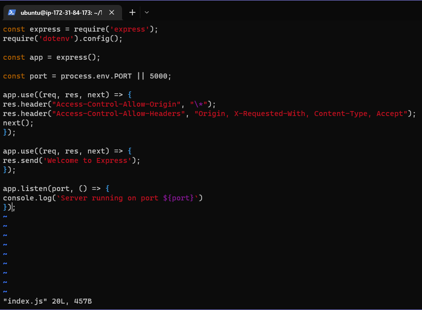
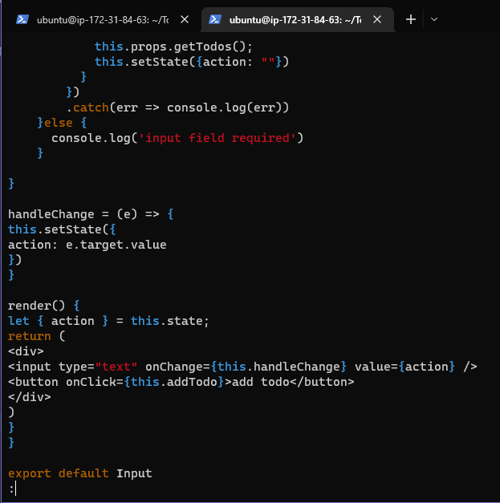

In this project we will be implementing a web solution based on MERN stack in AWS cloud 

# Backend configuration
First step is to connect to your EC2 instance and run `sudo apt update` and `sudo apt upgrade` 

 

We then need to get the location of Node.js software from Ubuntu repositories using `curl -sL https://deb.nodesource.com/setup_12.x | sudo -E bash -` and then install Node.js on the server with `sudo apt-get install -y nodejs` this command also installs NPM which is a package manager used to install Node modules & packages and to manage dependency conflicts 

The installation can be confirmed using `node -v` and `npm -v` 

 

Next step is to create a new directory for our To-Do list project `mkdir Todo` and confirm the directory has been created with the `ls` command, we can then change our current directory to our newly cereated one using `cd Todo` 

  

We then use `npm init` to initalise our project so a new file named "package.json" can be created. This file contains information about our application and dependecies that it needs to run. We can follow the prompts after running the command, accepty the default values and then accept to write out the file by typing yes. We can then use the `ls` command again to confirm this file has been created.

 

# Install ExpressJS 

ExpressJS is a framework for Node.js used to simplify development and abstracts a lot of low level details e.g. Express helps to define routes of our application based on HTTP methods and URLs

First we use npm to install express `npm install express` and then created the file "index.js" using 
`touch index.js` we can run the `ls` command once again to confirm this file has been created. 

 

Next we install the "dotenv" module `npm install dotenv` and then open the "index.js" file using `vim index.js` once we are here we type the following code in:

`const express = require('express');
require('dotenv').config();

const app = express();

const port = process.env.PORT || 5000;

app.use((req, res, next) => {
res.header("Access-Control-Allow-Origin", "\*");
res.header("Access-Control-Allow-Headers", "Origin, X-Requested-With, Content-Type, Accept");
next();
});

app.use((req, res, next) => {
res.send('Welcome to Express');
});

app.listen(port, () => {
console.log(`Server running on port ${port}`) 
});` 

*Remember to use :w and :qa to save and exit vim* 

  

We can then start our server to see if it works by using `node index.js` in the same directory as our index.js file. If done correctly we will see "Server running on port 5000" in our terminal 

   

We will now need to open this port in EC2 Security groups and open our browser to access our server's
public IP or DNS name followed by port 5000 "http://<PublicIP-or-PublicDNS>:5000" 

*Remember to get our server's Public IP/DNS name we can find it in our AWS web console or by running
the commands `curl -s http://169.254.169.254/latest/meta-data/public-ipv4` and `curl -s http://169.254.169.254/latest/meta-data/public-hostname`* 

   

   

Our To-Do application needs to be able to perform three actions:

1. Create a new task
2. Display list of all tasks
3. Delete a completed task 

Each of these tasks will be assocaited with a particular endpoint and will use different standard HTTP request methods: POST, GET, DELETE

We will need to create routes that will define various endpoints that our Todo app will depend on, first step is to create a folder `mkdir routes` we can then change directory into our routes folder using `cd routes` and then create a file "api.js" `api.js` once we open this file using `vim api.js`
we copy the following code into the file

`const express = require ('express');
const router = express.Router();

router.get('/todos', (req, res, next) => {

});

router.post('/todos', (req, res, next) => {

});

router.delete('/todos/:id', (req, res, next) => {

})

module.exports = router;` 

   
 
 # Models 

 We will now use Mongodb (a NoSQL database) to create a model. A model is at the heart of JavaScript
 based applications and it is what makes it interactive. 

 We will also use models to define the database schema. This will allow us to define the fields stored
 in each Mongodb document. The schema is a blueperint for how the database will be constructed,
 including virtual properties (other data fields that may not be required to be stored in the DB).

 To create a model and schema we install mongoose (a Node.js package that makes working with mongodb
 easier) `npm install mongoose` create a new folder "models" `mkdir models` and then change directory
 into the newly created "models" folder `cd models` inside this folder we create a file "todo.js" `touch todo.js` 

 *Tip: All three commands can be defined in one line and executed consequently with the help of "&&"
 operator: `mkdir models && cd models && touch todo.js`* 

 Once created open the file with `vim todo.js` and input the following code 

 `const mongoose = require('mongoose');
const Schema = mongoose.Schema;

//create schema for todo
const TodoSchema = new Schema({
action: {
type: String,
required: [true, 'The todo text field is required']
}
})

//create model for todo
const Todo = mongoose.model('todo', TodoSchema);

module.exports = Todo;` 

  

We now need to update our routes from the file "api.js" in our routes directory to make use of the new model, in this directory we open "api.js" with `vim api.js` delete the code inside with `:%d` and paste the following code inside

`const express = require ('express');
const router = express.Router();
const Todo = require('../models/todo');

router.get('/todos', (req, res, next) => {

//this will return all the data, exposing only the id and action field to the client
Todo.find({}, 'action')
.then(data => res.json(data))
.catch(next)
});

router.post('/todos', (req, res, next) => {
if(req.body.action){
Todo.create(req.body)
.then(data => res.json(data))
.catch(next)
}else {
res.json({
error: "The input field is empty"
})
}
});

router.delete('/todos/:id', (req, res, next) => {
Todo.findOneAndDelete({"_id": req.params.id})
.then(data => res.json(data))
.catch(next)
})

module.exports = router;` 

 

# MongoDB database 

Now we need a database where we will store our data, for this project we will make use of mLab which provides MongoDB database as a serveice solution (DBaaS).

Once an account is set up we must allow access to the MongoDB database from anywhere (Not secure but ideal for testing) and then create MongoDB database and collection inside mLab

 

Previously in our "index.js" file we specified "process.env" to access environment variables, we will need to create this file in our Todo directory and name it ".env" `touch .env` we then open and add the connection string below to access the database

`DB = 'mongodb+srv://<username>:<password>@<network-address>/<dbname>?retryWrites=true&w=majority'` 

We can obtain our connection string from MongoDB by clicking Connect -> Connect your application 

 

Next step is to update our "index.js" to reflect the use of ".env" so that Node.js can connect to the
database. Use the following command `vim index.js` and replace the contents with the following code

`const express = require('express');
const bodyParser = require('body-parser');
const mongoose = require('mongoose');
const routes = require('./routes/api');
const path = require('path');
require('dotenv').config();

const app = express();

const port = process.env.PORT || 5000;

//connect to the database
mongoose.connect(process.env.DB, { useNewUrlParser: true, useUnifiedTopology: true })
.then(() => console.log(`Database connected successfully`))
.catch(err => console.log(err));

//since mongoose promise is depreciated, we overide it with node's promise
mongoose.Promise = global.Promise;

app.use((req, res, next) => {
res.header("Access-Control-Allow-Origin", "\*");
res.header("Access-Control-Allow-Headers", "Origin, X-Requested-With, Content-Type, Accept");
next();
});

app.use(bodyParser.json());

app.use('/api', routes);

app.use((err, req, res, next) => {
console.log(err);
next();
});

app.listen(port, () => {
console.log(`Server running on port ${port}`)
});`  

*Remember to use Esc, :%d, Enter to clear file and i (insert mode) for vim* 

  

We can then start our server using `node index.js` the message ‘Database connected successfully’ 
will appear to show that we have our backend configured 
 
 

### Testing Backend Code without Frontend using RESTful API

RESTful API can be used to test our code during deployment, in this project we use Postman to test our API. 

# Frontend configuration

In this step we must now create a user interface for a web client (browser) to interact with the 
application via API. First we must run `npx create-react-app client` in the same directory as our backend code, this creates a new folder called "client" where we can add all the react code.

 

### Running a React App

Before we can test the react App we will need to install some dependencies:

1. `npm install concurrently --save-dev` - used to run more than one command simultaneously from the same terminal window
2. `npm install nodemon --save-dev` - used to run and monitor the server. If there is any change in the server code, nodemon will restart it automatically and load the new changes.

We then need to open our "package.json" file in the Todo folder and replace a section of code

`"scripts": {
"start": "node index.js",
"start-watch": "nodemon index.js",
"dev": "concurrently \"npm run start-watch\" \"cd client && npm start\""
},` 

### Configure Proxy in package.json

Next we change directory to client `cd client` and open the "package.json" file `vi package.json`
once inside we add the key value pair "proxy": "http://localhost:5000". After this we must switch back to our Todo directory and use `npm run dev` which will allow our app to open and run on localhost:3000 

We must also open TCP port 3000 on our EC2 in order access the application from the internet 

  

  

### Creating your React Components

For our Todo app there will be two stateful components and one stateless component, whilst in our client directory we must move to our src directory `cd src` and create another folder called "components" `mkdir components` once we are here we create three files using `touch Input.js ListTodo.js Todo.js` we can then open our "Input.js" file `vi Input.js` and place the following inside

`import React, { Component } from 'react';
import axios from 'axios';

class Input extends Component {

state = {
action: ""
}

addTodo = () => {
const task = {action: this.state.action}

    if(task.action && task.action.length > 0){
      axios.post('/api/todos', task)
        .then(res => {
          if(res.data){
            this.props.getTodos();
            this.setState({action: ""})
          }
        })
        .catch(err => console.log(err))
    }else {
      console.log('input field required')
    }

}

handleChange = (e) => {
this.setState({
action: e.target.value
})
}

render() {
let { action } = this.state;
return (

<input type="text" onChange={this.handleChange} value={action} />
<button onClick={this.addTodo}>add todo</button>

)
}
}

export default Input` 

  

Now we need to install Axios inside of our clients directory, this is a promise based HTTP client for the browser and node.js. `npm install axios` 

Once this is completed go back to our components directory and paste the following code in the "ListTodo.js" file and "Todo.js" file respectively 

`import React from 'react';

const ListTodo = ({ todos, deleteTodo }) => {

return (
<ul>
{
todos &&
todos.length > 0 ?
(
todos.map(todo => {
return (
<li key={todo._id} onClick={() => deleteTodo(todo._id)}>{todo.action}</li>
)
})
)
:
(
<li>No todo(s) left</li>
)
}
</ul>
)
}

export default ListTodo` 

`import React, {Component} from 'react';
import axios from 'axios';

import Input from './Input';
import ListTodo from './ListTodo';

class Todo extends Component {

state = {
todos: []
}

componentDidMount(){
this.getTodos();
}

getTodos = () => {
axios.get('/api/todos')
.then(res => {
if(res.data){
this.setState({
todos: res.data
})
}
})
.catch(err => console.log(err))
}

deleteTodo = (id) => {

    axios.delete(`/api/todos/${id}`)
      .then(res => {
        if(res.data){
          this.getTodos()
        }
      })
      .catch(err => console.log(err))

}

render() {
let { todos } = this.state;

    return(
      

        <h1>My Todo(s)</h1>
        <Input getTodos={this.getTodos}/>
        <ListTodo todos={todos} deleteTodo={this.deleteTodo}/>
      

    )

}
}

export default Todo;` 

We now need to make some adjustments to our react code and adjust our App.js, first we move back into the src directory and use `vi App.js` and paste the following code

`import React from 'react';

import Todo from './components/Todo';
import './App.css';

const App = () => {
return (

<Todo />

);
}

export default App;` 

We then need to open the "App.css" file with `vi App.css` and paste the following code 

`.App {
text-align: center;
font-size: calc(10px + 2vmin);
width: 60%;
margin-left: auto;
margin-right: auto;
}

input {
height: 40px;
width: 50%;
border: none;
border-bottom: 2px #101113 solid;
background: none;
font-size: 1.5rem;
color: #787a80;
}

input:focus {
outline: none;
}

button {
width: 25%;
height: 45px;
border: none;
margin-left: 10px;
font-size: 25px;
background: #101113;
border-radius: 5px;
color: #787a80;
cursor: pointer;
}

button:focus {
outline: none;
}

ul {
list-style: none;
text-align: left;
padding: 15px;
background: #171a1f;
border-radius: 5px;
}

li {
padding: 15px;
font-size: 1.5rem;
margin-bottom: 15px;
background: #282c34;
border-radius: 5px;
overflow-wrap: break-word;
cursor: pointer;
}

@media only screen and (min-width: 300px) {
.App {
width: 80%;
}

input {
width: 100%
}

button {
width: 100%;
margin-top: 15px;
margin-left: 0;
}
}

@media only screen and (min-width: 640px) {
.App {
width: 60%;
}

input {
width: 50%;
}

button {
width: 30%;
margin-left: 10px;
margin-top: 0;
}
}`  

Finally we open our "index.css" file `index.css` and copy and paste the following code

`body {
margin: 0;
padding: 0;
font-family: -apple-system, BlinkMacSystemFont, "Segoe UI", "Roboto", "Oxygen",
"Ubuntu", "Cantarell", "Fira Sans", "Droid Sans", "Helvetica Neue",
sans-serif;
-webkit-font-smoothing: antialiased;
-moz-osx-font-smoothing: grayscale;
box-sizing: border-box;
background-color: #282c34;
color: #787a80;
}

code {
font-family: source-code-pro, Menlo, Monaco, Consolas, "Courier New",
monospace;
}` 

Once complete we go back to our Todo directory and run `npm run dev` again, our To-Do app should now be ready and fully functional: creating a task, deleting a task and viewing all our tasks. 

   

 
