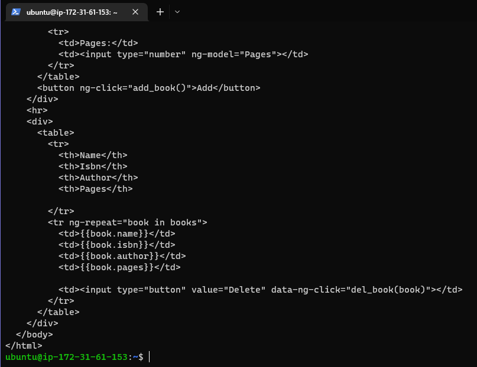

In this project we will be familiarising ourselves with the MEAN stack and deploying it onto Ubuntu server. We will be implementing a simple Book Register web form. 


In the previous projects we used various tools to connect to our EC2 instance, this time we will be using 
the AWS Web Console to open our CLI

 

 

# Install NodeJs

Node.js will be used in this project to set up the Express routes and AngularJS controllers

First step is to run `sudo apt update` and `sudo apt upgrade` we must then add certificates using 

```
sudo apt -y install curl dirmngr apt-transport-https lsb-release ca-certificates

curl -sL https://deb.nodesource.com/setup_12.x | sudo -E bash -
```

Once completed we can then go ahead and install NodeJS `sudo apt install -y nodejs` 

 

# Install MongoDB

MongoDB stores data in flexible JSON-like documents. This is important as fields in a database can vary from document to document and data structures may change over time. For our application we will be adding book records to MongoDB that contain book name, isbn number, author, and number of pages 

```
sudo apt-key adv --keyserver hkp://keyserver.ubuntu.com:80 --recv 0C49F3730359A14518585931BC711F9BA15703C6

echo "deb [ arch=amd64 ] https://repo.mongodb.org/apt/ubuntu trusty/mongodb-org/3.4 multiverse" | sudo tee /etc/apt/sources.list.d/mongodb-org-3.4.list
```

 

We can then install MongoDB using `sudo apt install -y mongodb` and start the server `sudo service mongodb start`

 

*Tip: To verify the service is up and running we can use `sudo systemctl status mongodb`*

Next we will need to install npm (Node package manager) `sudo apt install -y npm` and install body-parser package (This will help us process JSON files passed in requests to the server) `sudo npm install body-parser`

  
*Tip: Remember to use `npm --version` to verify installation*

We can then create a folder named "Books" `mkdir Books && cd Books` and initalise the npm project once in the directory `npm init` we must then add a file named "index.js" and copy and paste the following web server code into the file 

```js
var express = require('express');
var bodyParser = require('body-parser');
var app = express();
app.use(express.static(__dirname + '/public'));
app.use(bodyParser.json());
require('./apps/routes')(app);
app.set('port', 3300);
app.listen(app.get('port'), function() {
    console.log('Server up: http://localhost:' + app.get('port'));
});
```
  

# Install Express and set up routes to the server

We will need Express to pass book information to and from our MongoDB database. Express is a minimal 
and flexible Node.js web application framework that provides features for web and mobile applications.

We will also need to use Mongoose package which provides us with a straight-forward, schema-based solution to model our application data. We will use this to establish a schema for the database to 
store data of our book register. 

First step is to install both express and mongoose `sudo npm install express mongoose` after this we must create a folder named "apps" in our Books directory `mkdir apps && cd apps` once here we must create a file named "routes.js" and copy and paste the following 

```js
var Book = require('./models/book');
module.exports = function(app) {
  app.get('/book', function(req, res) {
    Book.find({}, function(err, result) {
      if ( err ) throw err;
      res.json(result);
    });
  }); 
  app.post('/book', function(req, res) {
    var book = new Book( {
      name:req.body.name,
      isbn:req.body.isbn,
      author:req.body.author,
      pages:req.body.pages
    });
    book.save(function(err, result) {
      if ( err ) throw err;
      res.json( {
        message:"Successfully added book",
        book:result
      });
    });
  });
  app.delete("/book/:isbn", function(req, res) {
    Book.findOneAndRemove(req.query, function(err, result) {
      if ( err ) throw err;
      res.json( {
        message: "Successfully deleted the book",
        book: result
      });
    });
  });
  var path = require('path');
  app.get('*', function(req, res) {
    res.sendfile(path.join(__dirname + '/public', 'index.html'));
  });
};
```

 

In our apps folder we must also create a folder named "models" `mkdir models && cd models` once created we generate a new file named "book.js" and insert the following 

```js
var mongoose = require('mongoose');
var dbHost = 'mongodb://localhost:27017/test';
mongoose.connect(dbHost);
mongoose.connection;
mongoose.set('debug', true);
var bookSchema = mongoose.Schema( {
  name: String,
  isbn: {type: String, index: true},
  author: String,
  pages: Number
});
var Book = mongoose.model('Book', bookSchema);
module.exports = mongoose.model('Book', bookSchema);
```

 

# Access the routes with AngularJS

AngularJS can be used to provide a web framework for creating dynamic views in our web applications. We will use AngularJS in our application to connect our web page with Express and perform actions on our book register 

First we must change directory back to books `cd ../..` and create a folder named "public" `mkdir public && cd public` once here we create a file named "script.js" and input the following code 

```js
var app = angular.module('myApp', []);
app.controller('myCtrl', function($scope, $http) {
  $http( {
    method: 'GET',
    url: '/book'
  }).then(function successCallback(response) {
    $scope.books = response.data;
  }, function errorCallback(response) {
    console.log('Error: ' + response);
  });
  $scope.del_book = function(book) {
    $http( {
      method: 'DELETE',
      url: '/book/:isbn',
      params: {'isbn': book.isbn}
    }).then(function successCallback(response) {
      console.log(response);
    }, function errorCallback(response) {
      console.log('Error: ' + response);
    });
  };
  $scope.add_book = function() {
    var body = '{ "name": "' + $scope.Name + 
    '", "isbn": "' + $scope.Isbn +
    '", "author": "' + $scope.Author + 
    '", "pages": "' + $scope.Pages + '" }';
    $http({
      method: 'POST',
      url: '/book',
      data: body
    }).then(function successCallback(response) {
      console.log(response);
    }, function errorCallback(response) {
      console.log('Error: ' + response);
    });
  };
});
``` 

In the same folder we must also create a file named "index.html" and insert the following code 

```html
<!doctype html>
<html ng-app="myApp" ng-controller="myCtrl">
  <head>
    <script src="https://ajax.googleapis.com/ajax/libs/angularjs/1.6.4/angular.min.js"></script>
    <script src="script.js"></script>
  </head>
  <body>
    <div>
      <table>
        <tr>
          <td>Name:</td>
          <td><input type="text" ng-model="Name"></td>
        </tr>
        <tr>
          <td>Isbn:</td>
          <td><input type="text" ng-model="Isbn"></td>
        </tr>
        <tr>
          <td>Author:</td>
          <td><input type="text" ng-model="Author"></td>
        </tr>
        <tr>
          <td>Pages:</td>
          <td><input type="number" ng-model="Pages"></td>
        </tr>
      </table>
      <button ng-click="add_book()">Add</button>
    </div>
    <hr>
    <div>
      <table>
        <tr>
          <th>Name</th>
          <th>Isbn</th>
          <th>Author</th>
          <th>Pages</th>

        </tr>
        <tr ng-repeat="book in books">
          <td>{{book.name}}</td>
          <td>{{book.isbn}}</td>
          <td>{{book.author}}</td>
          <td>{{book.pages}}</td>

          <td><input type="button" value="Delete" data-ng-click="del_book(book)"></td>
        </tr>
      </table>
    </div>
  </body>
</html>
```

Once complete we can change back into our Books directory and start the server by running the command
`node index.js` the server should be up and running and we should be able to connect via port 3300. To confirm this we can launch a seperate SSH console and run `curl -s http://localhost:3300` and we should recieve the following output

 

 

We will be able to see our Web Book Register Application more clearly via web browser using our Public IP address or Public DNS name 
*Tip: Remember to ensure port 3300 is open by checking our security group on AWS Console, we can also run `curl -s http://169.254.169.254/latest/meta-data/public-ipv4` or `curl -s http://169.254.169.254/latest/meta-data/public-hostname` to retrieve our Public IP address or Public DNS name* 

 