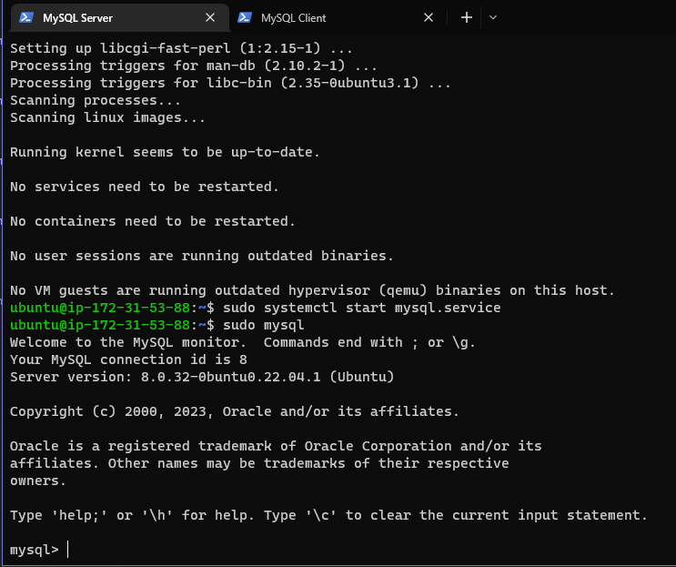

# Implement a Client/Server architecture using MySQL DBMS

In this project we will demonstrate a basic client-server using MySQL Relational Database Management 
System (RDBMS)

First we must create and configure two Ubuntu servers through AWS named "mysql server" and "mysql server" 

 

We must now install MySQL Server/Client software on both mysql server/mysql server instances 

Once complete we must complete the mysql set up, we can refer to project 2 to complete the steps for this

We can use mysql server's local IP address to connect from mysql client, MySQL server uses TCP port 3306 by default so we must create a new entry for imbound rules in our "mysql server" security group.

We will also need to configure our MySQL server to allow connections from remote hosts, we can do this using `sudo vi /etc/mysql/mysql.conf.d/mysqld.cnf` and replacing ‘127.0.0.1’ to ‘0.0.0.0’ 

  

After this we must now connect remotely to our mysql server database engine from our mysql client server using `sudo muysql -u mark -h 54.82.168.195 -p` we can check if we have successfully connected by running `Show databases;`

  

