In this project we will be preparing storage infrastructure on two Linux servers and implementing a basic web solution
using WordPress. Wordpress is a free and open-source content management system written in PHP and paired with MySQL or
MariaDB as its backend Relational Database Management System (RDBMS).

# RedHat 
In our previous projects we have used Ubuntu as an OS for our EC2 instances, we will be using RedHat in this project

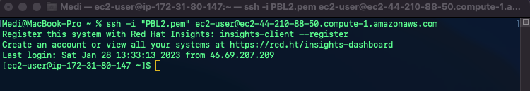 

*Note: for Ubuntu server, when connecting to it via SSH/Putty or any other tool, we used "ubuntu" user, but for RedHat you will need to use "ec2-user" user. Connection string will look like "ec2-user@<Public-IP>"*

# Preparing a Web Server

Next step is to create 3 volumes in the same Availability Zone as our web server EC2 each of 10 GiB 

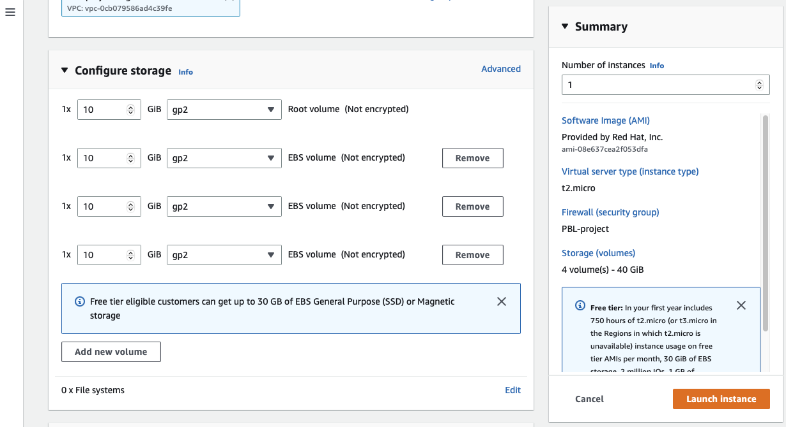 

After opening up the Linux terminal, use `lsblk` to inspect what block devices are attached are attached to the server, we can also use `ls /dev/` 
to make sure all 3 newly created block devices are there (All devices in Linux reside in /dev/ directory)

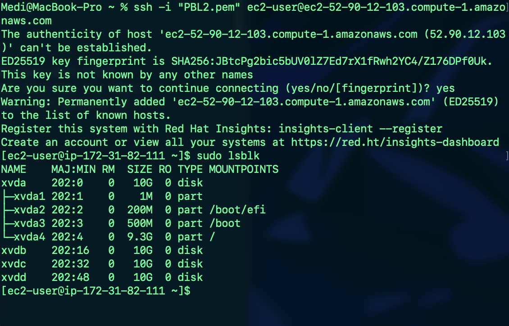

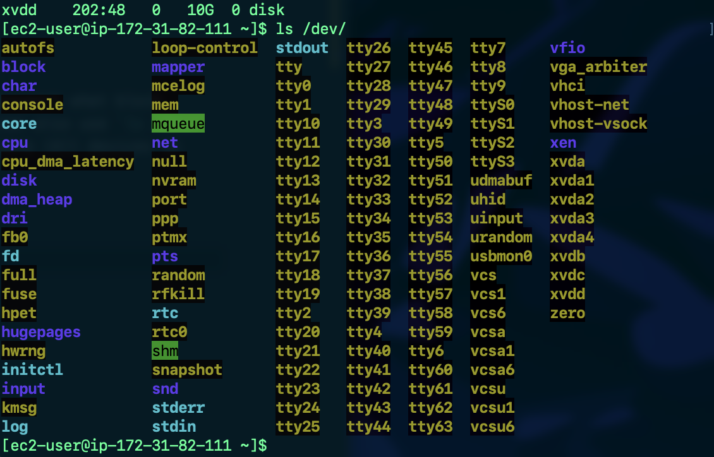

We should also use `df -h` to see all mounts and free space on our server

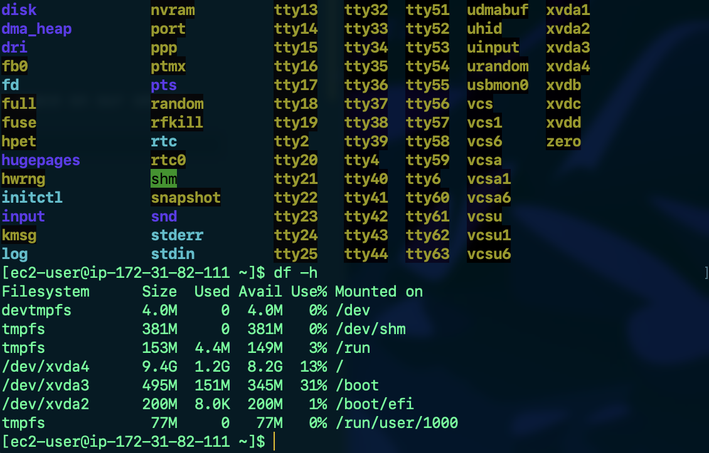

Now we can create a single partition on each of the 3 disks through the command `sudo gdisk /dev/xvdb` once complete we can use the `lsblk` command again to view the newly configured parition on each of the 3 disks 

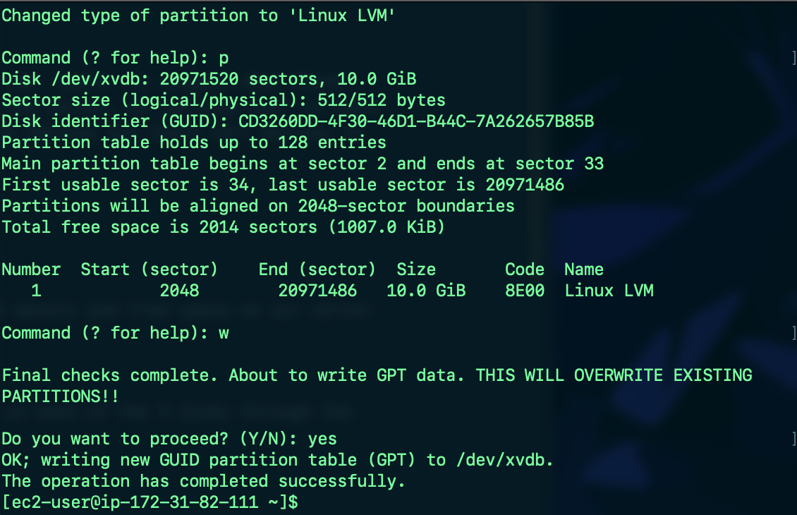

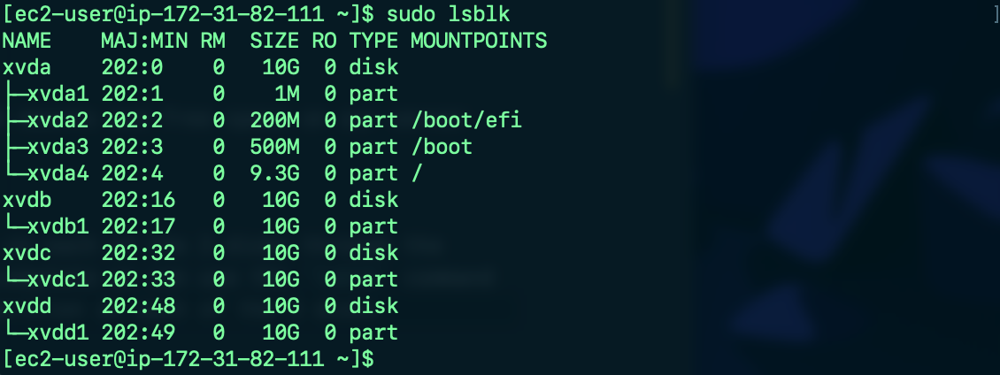

We must now install lvm2 package using `sudo yum install lvm2` and check for available partitions by running `sudo lvmdiskscan` 

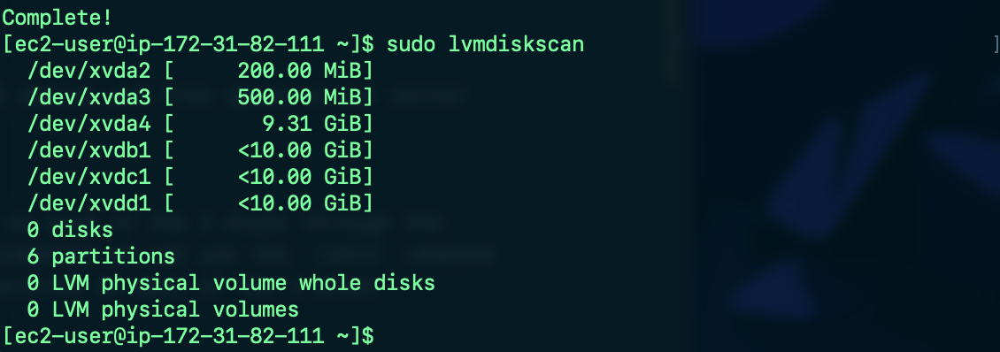

Next we use `pvcreate` utility to mark each of the 3 disks as physical volumes (PVs) to be used by LVM, we can verify our physical volume has been created sucessfully by running `sudo pvs`

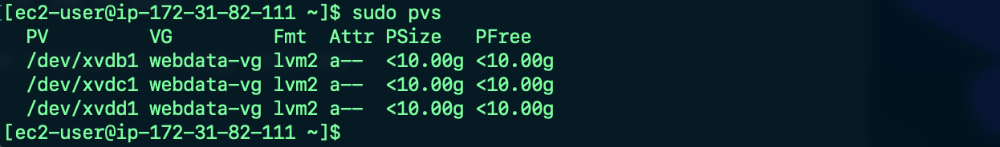

Once this is complete we use `vgcreate` utility to add all 3 PVs to a volume group (VG). We will be naming the VG "webdata-vg", verify the VG has been created using `sudo vgs` 

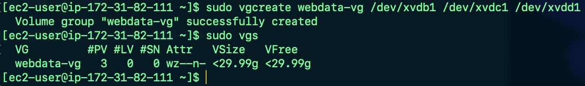

`lvcreate` utility will be used to create 2 logical volumes. 
->"apps-lv" - Uses half of the PV size
->"logs-lv" - Uses the remaining space of the PV size

Again we can verify these LVs have been created bu running `sudo lvs`

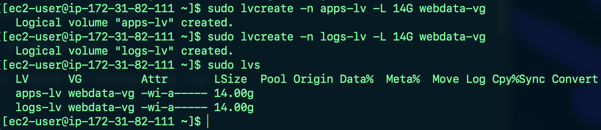

We can verify the entire setup with `sudo vgdisplay -v #view complete setup - VG, PV, and LV` and `sudo lsblk` 

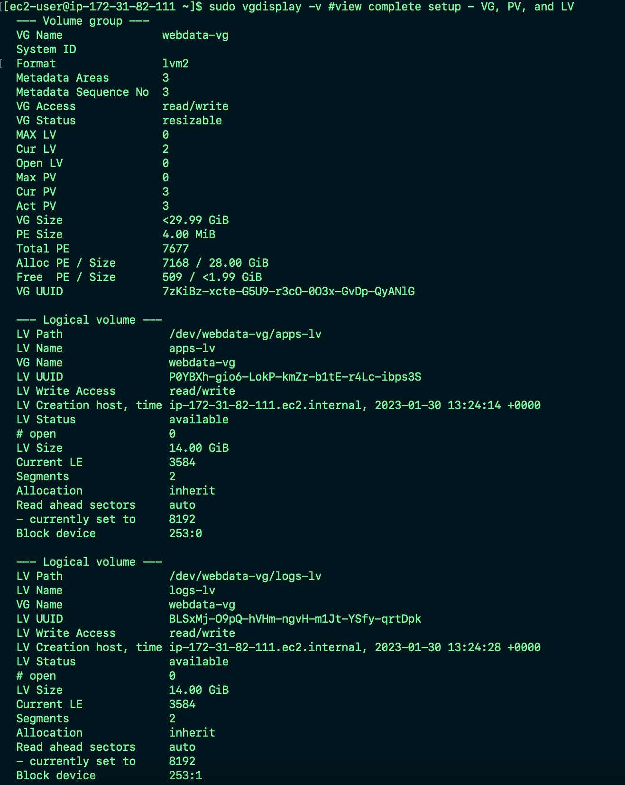

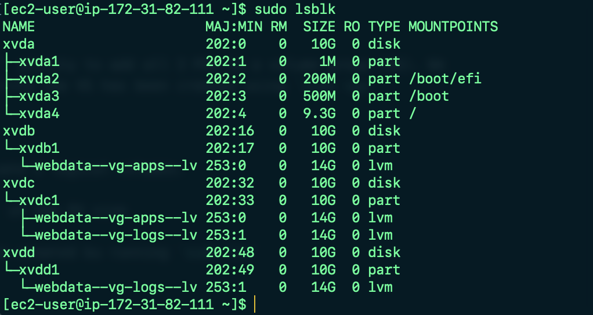

Next we must use `mkfs.ext4` to format the LVs with ext4 filesystem using these commands `sudo mkfs -t ext4 /dev/webdata-vg/apps-lv` and `sudo mkfs -t ext4 /dev/webdata-vg/logs-lv` 

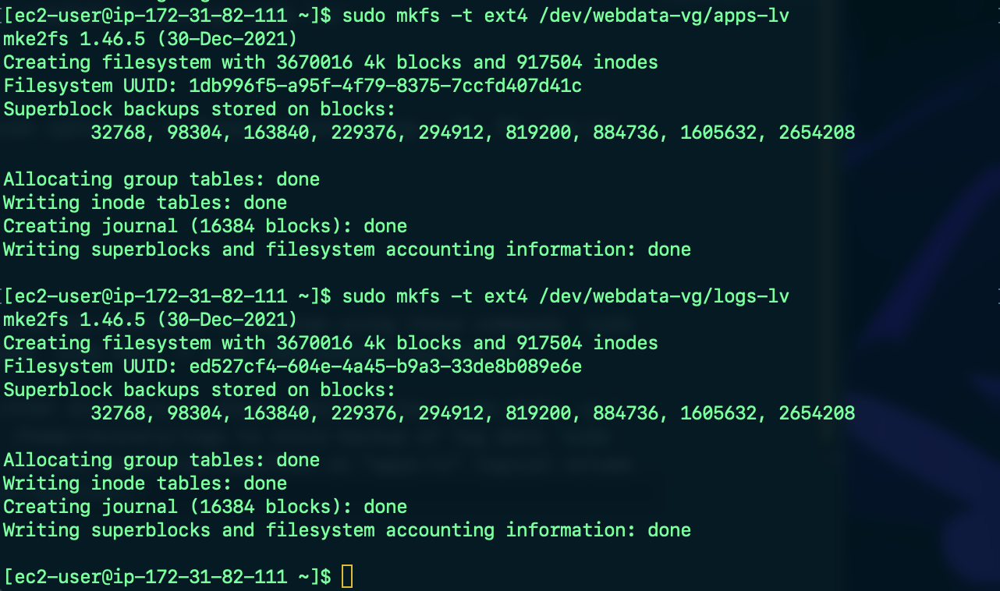

After this we must create the /var/www/html directory to store website files `sudo mkdir -p /var/www/html`, we must also create the /home/recovery/logs to store backup of log data `sudo mkdir -p /home/recovery/logs` and then we must mount /var/www/html on "apps-lv" logical volume `sudo mount /dev/webdata-vg/apps-lv /var/www/html/` 

Next steps are to backup all the files in the log directory /var/log into /home/recovery/logs using rsync `sudo rsync -av /var/log/. /home/recovery/logs/`, we must then mount /var/log on logs-lv logical volume `sudo rsync -av /var/log/. /home/recovery/logs/`(the existing data on 
/var/log will be deleted which is why a backup is important)

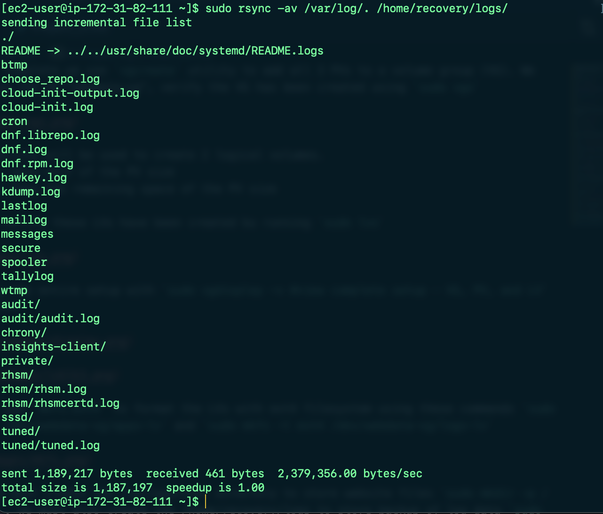

We can now restore the log files back into /var/log directory using `sudo rsync -av /home/recovery/logs/. /var/log` 

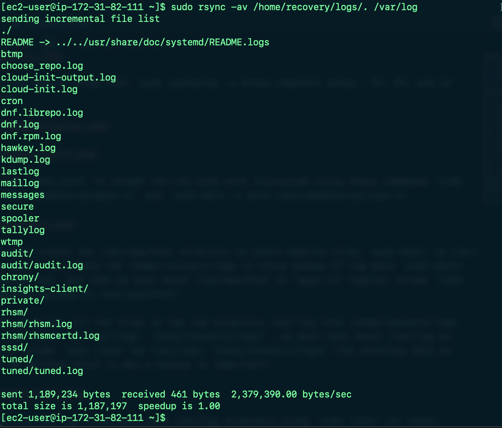

Now we must update the /etc/fstab file so our mount configuration will remain after restart of the server using Vi editor, after this we must test the configuration and reload the daemon using `sudo mount -a sudo systemctl daemon-reload` and verify our setup by running `df -h`

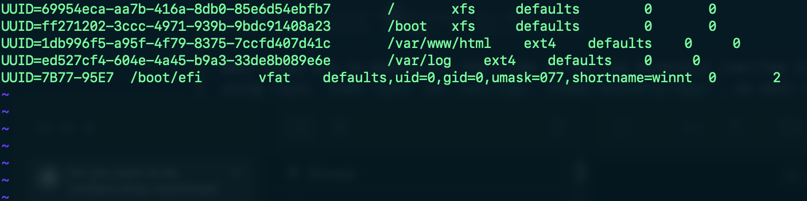

*Tip: Use the `sudo blkid` command to find the UUID of the device*

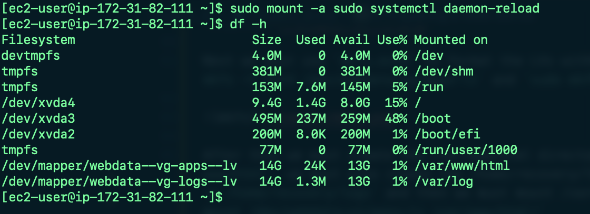

# Prepare the Database Server 

For this step we must repeat the same steps that we completed for our Web Server EC2 instance, instead of "apps-lv" we must create "db-lv" and mount it to /db directory instead of /var/www/html/

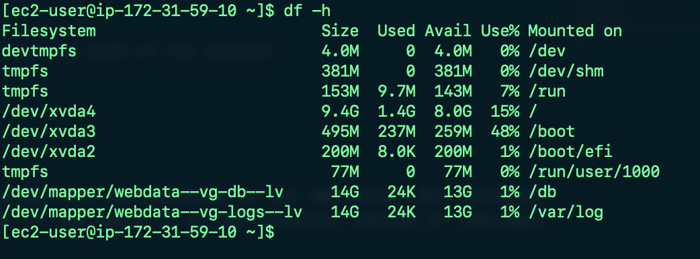

# Install WordPress on our Web Server EC2 

First we must update the repository with `sudo yum -y update` after this we must install wget, Apache and it's dependencies `sudo yum -y install wget httpd php php-mysqlnd php-fpm php-json` we can then start Apache using `sudo systemctl enable httpd sudo systemctl start httpd`

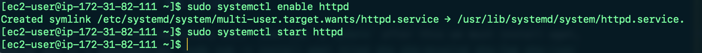

Next we must now install PHP and it's dependencies:

```
sudo yum install https://dl.fedoraproject.org/pub/epel/epel-release-latest-9.noarch.rpm
sudo yum install yum-utils http://rpms.remirepo.net/enterprise/remi-release-8.rpm
sudo yum module list php sudo yum module reset php sudo yum module enable php:remi-7.4 
sudo yum install php php-opcache php-gd php-curl php-mysqlnd
sudo systemctl start php-fpm sudo systemctl enable php-fpm
setsebool -P httpd_execmem 1
```

Restart Apache `sudo systemctl restart httpd` we must also download and copy wordpress to var/www/html 

```
mkdir wordpress
cd wordpress
sudo wget http://wordpress.org/latest.tar.gz sudo tar xzvf latest.tar.gz
sudo rm -rf latest.tar.gz
cp wordpress/wp-config-sample.php wordpress/wp-config.php
cp -R wordpress /var/www/html/ 
```

After this we can configure SELinux Policies 

```
sudo chown -R apache:apache /var/www/html/wordpress
sudo chcon -t httpd_sys_rw_content_t /var/www/html/wordpress -R
sudo setsebool -P httpd_can_network_connect=1
```

# Install MySQL on your DB Server EC2 

We must install mysql server `sudo yum install mysql-server` and verify the service is up and running by using `sudo systemctl status mysqld` 

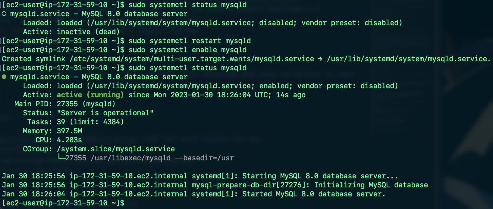

*Tip use `sudo systemctl restart mysqld` and `sudo systemctl enable mysqld` to restart and enable ther service if it is not running*

Next we must configure our database to work with wordpress (IP address = Web Server private IP)

```
sudo mysql
CREATE DATABASE wordpress;
CREATE USER `myuser`@`<172.31.82.111>` IDENTIFIED BY 'mypass';
GRANT ALL ON wordpress.* TO 'myuser'@'<172.31.82.111>';
FLUSH PRIVILEGES;
SHOW DATABASES;
exit
```

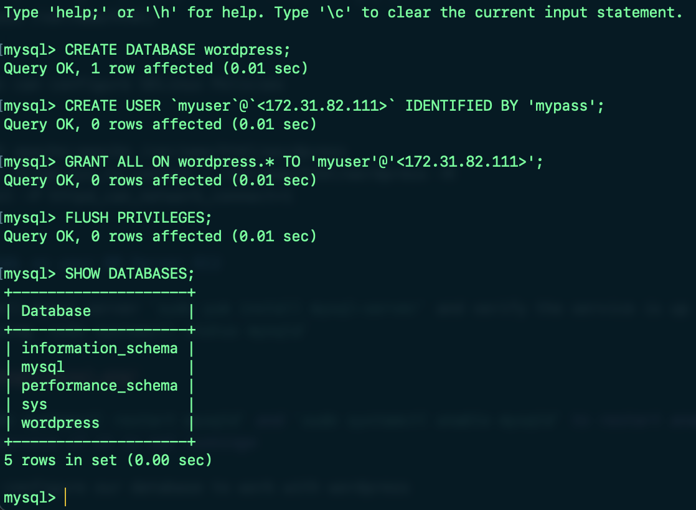

# Configure WordPress to connect to remote database

First step for this final part is to open port 3306 on our DB Server EC2, we must also allow access to the DB server only from our Web Server's IP address 

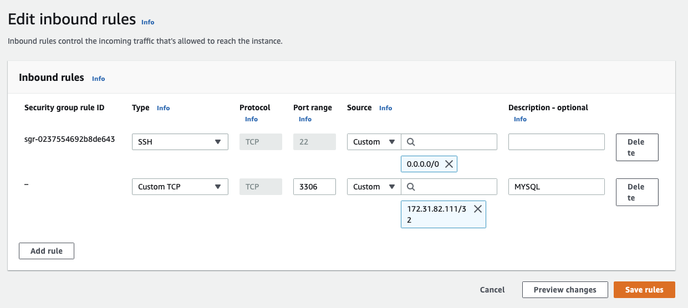

We can now install MySQL client and test that we can connect from our Web Server to our DB server using mysql-client (IP address = DB Server private IP)

```
sudo yum install mysql
sudo mysql -u admin -p -h <172.31.59.10>
```


