In this project we will be implementing a tooling website solution which makes access to DevOps
tools within the corporate infrastructure easily accessible 

# Preparing NFS server 
First step is to spin up a new RHEL EC2 instance and configure LVM on the server based on our experience gained during Project 6 

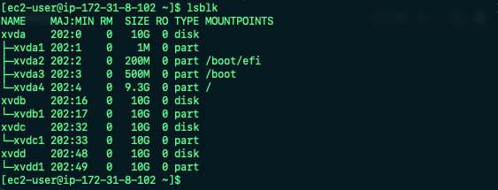 

Instead of formatting as ext4 we must format them as xfs, we must also ensure there are 3 LVs "lv-opt", "lv-apps" and "lv-logs"

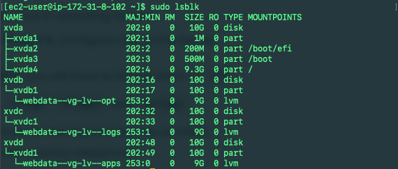

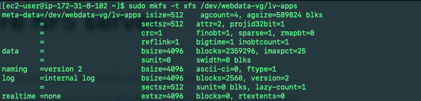

Next steps are to create mount points on /mnt directory for the logical volumes 

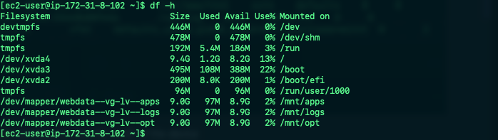

*Note: /mnt/apps will be used by webservers, /mnt/logs will be used by webserver logs and /mnt/opt will be used by our Jenkins server in Project 8.*

We can now install NFS Server, configure it to start on reboot and make sure it is up and running

```
sudo yum -y update
sudo yum install nfs-utils -y
sudo systemctl start nfs-server.service
sudo systemctl enable nfs-server.service
sudo systemctl status nfs-server.service
```

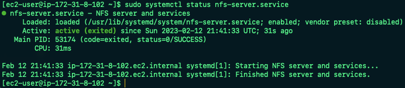

Now we must export the mounts for webservers' "subnet cidr" to connect as clients. We will install all our three Web Servers inside the same subnet, however in production you would usually seperate each tier inside its own subnet for higher level of security. To check our subnet cidr we must open our EC2 details in AWS Web Console, locate the 'Networking' tab and open a Subnet link 

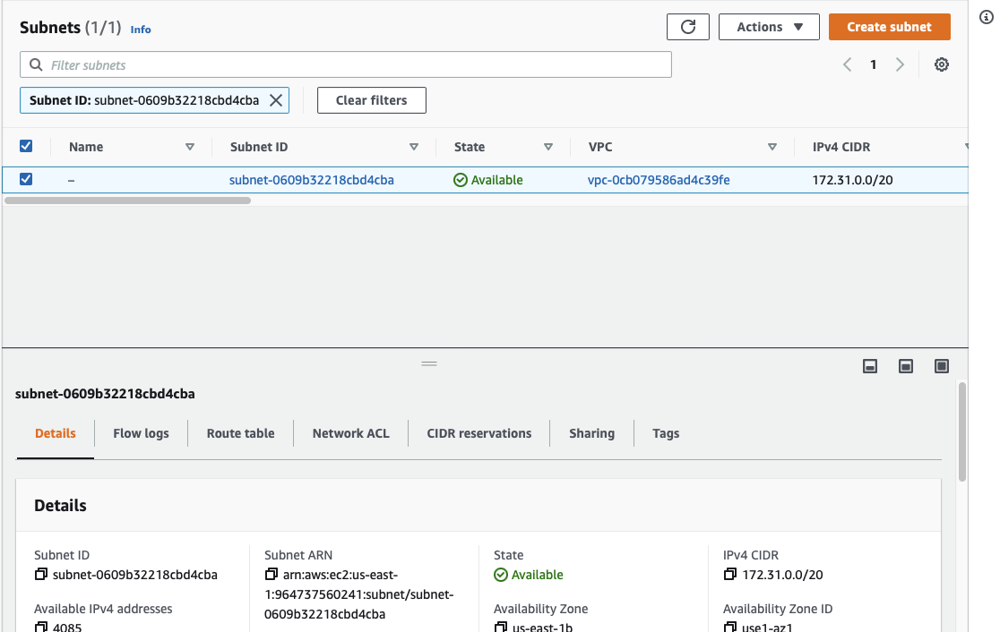

Next we must set up permissions that allow our Web Servers to read, write and execute files on NFS

```
sudo chown -R nobody: /mnt/apps
sudo chown -R nobody: /mnt/logs
sudo chown -R nobody: /mnt/opt

sudo chmod -R 777 /mnt/apps
sudo chmod -R 777 /mnt/logs
sudo chmod -R 777 /mnt/opt

sudo systemctl restart nfs-server.service
```

We then configure access to NFS for clients within the same subnet (E.g. Subnet CIDR - 172.31.32.0/20) by editing the exports file `sudo vi /etc/exports` with the following below and then running `sudo exportfs -arv` 

```
/mnt/apps <Subnet-CIDR>(rw,sync,no_all_squash,no_root_squash)
/mnt/logs <Subnet-CIDR>(rw,sync,no_all_squash,no_root_squash)
/mnt/opt <Subnet-CIDR>(rw,sync,no_all_squash,no_root_squash)
``` 

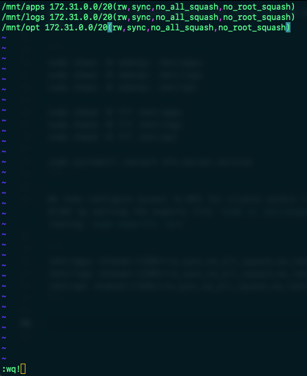

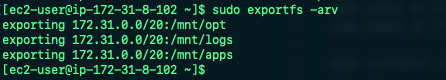

Next check which port is used by NFS and open it using Security groups via AWS Web Console
`rpcinfo -p | grep nfs` 

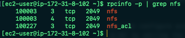

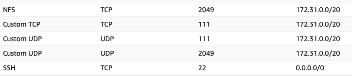

*Note: In order for NFS Server to be accessible from our client we must also open TCP 111, UDP 111 and 2049*

# Configuring the database server 

In this step we will install and configure a MySQL DBMS to work with our remote Web Server, we must create a database named "tooling", a database user named "webaccess" and grant permission to "webaccess" user on our "tooling" database to do anything only from the webservers subnet cidr (172.31.32.0/20)

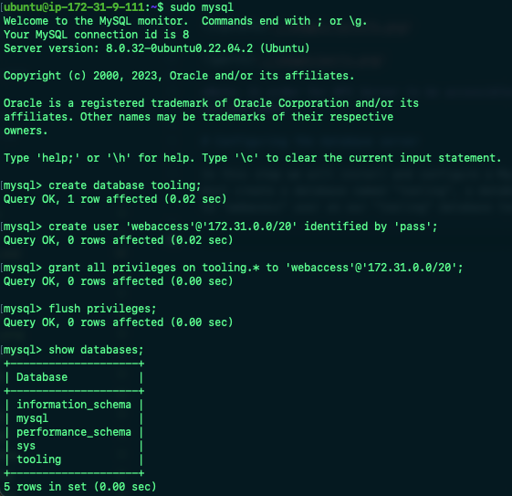

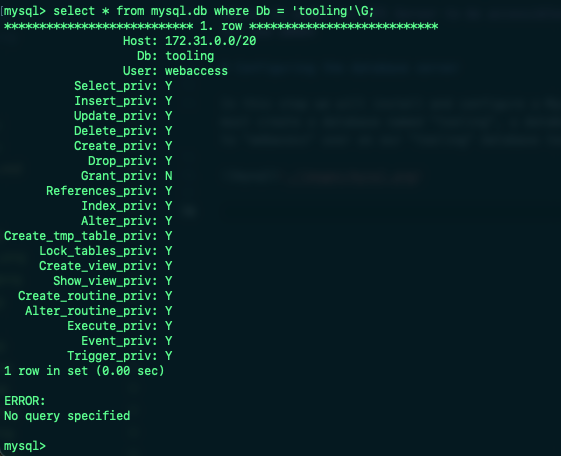

# Preparing the Web Servers 

Finally we must make sure our Web Servers can serve the same content from shared storage solutions (NFS Server and MySQL DB). We will utilise NFS for storing shared files that our Web Servers will use, we will also mount our previously created LV (lv-apps) to the folder where Apache stores files to be served to the users (/var/www)

This will allow our Web Servers to be "stateless" meaning we will be able to add new Servers or remove them whenever we need and the integrity of the data (in the DB and on NFS) will be maintained. 

In this final stage we will complete the following:

1. Configure NFS client 
2. Deploy a Tooling application to our Web Servers into a shared NFS folder
3. Configure the Web Servers to work with a single MySQL DB 

*Note: These steps must be completed for all 3 Web Servers*

First we must install NFS client `sudo yum install nfs-utils nfs4-acl-tools -y` and then mount /var/www/ and target the NFS server's export for apps, verify NFS was mounted successfully by running `df-h`

```
sudo mkdir /var/www
sudo mount -t nfs -o rw,nosuid <NFS-Server-Private-IP-Address>:/mnt/apps /var/www
```

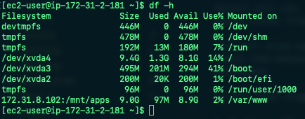

To make sure our changes will remain on Web Server after reboot we must edit the fstab file `sudo vi /etc/fstab` and add the following `<NFS-Server-Private-IP-Address>:/mnt/apps /var/www nfs defaults 0 0` 

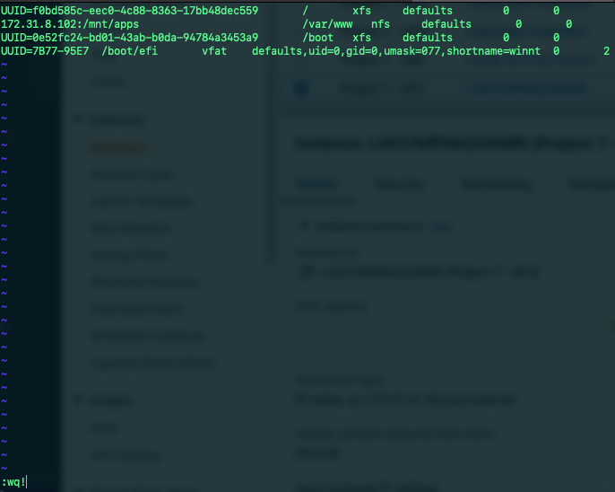

We must now install Remi's repositiory, Apache and PHP

```
sudo yum install httpd -y
sudo dnf install https://dl.fedoraproject.org/pub/epel/epel-release-latest-8.noarch.rpm
sudo dnf install dnf-utils http://rpms.remirepo.net/enterprise/remi-release-8.rpm
sudo dnf module reset php
sudo dnf module enable php:remi-7.4
sudo dnf install php php-opcache php-gd php-curl php-mysqlnd
sudo systemctl start php-fpm
sudo systemctl enable php-fpm
setsebool -P httpd_execmem 1
```

We can verify that Apache files and directories are available on the Web Server in /var/www and also on the NFS server in /mnt/apps by checking to see if the same files exist in both directories 

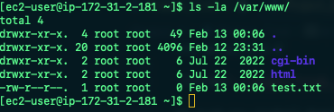

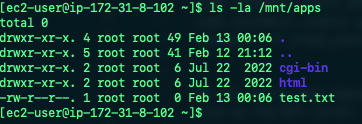

We will then need to locate the log folder for Apache on the Web Server and mount this to our NFS Server's export for logs `sudo mount -t nfs -o rw,nosuid 172.31.8.102:/mnt/logs /var/log/httpd`. We must remember to configure our fstab file to ensure the mount point will persist after reboot.

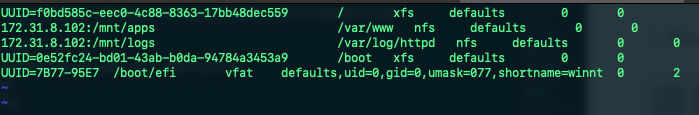

We must then fork the tooling source code from Darey.io's Github Account to our own Web Server, we must also deploy the tooling website's code to the Webserver ensuring that the html folder from the repository is deployed to /var/www/html 

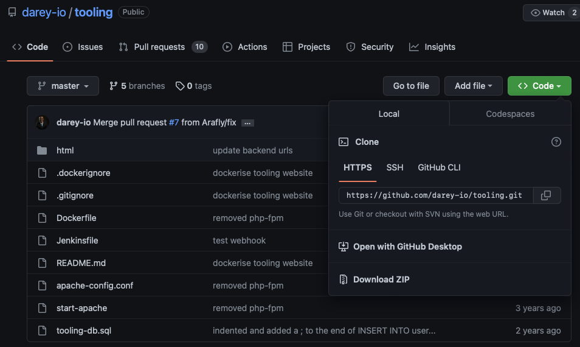

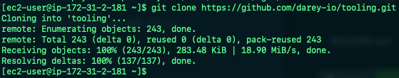

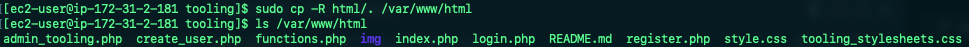

Next steps are to open TCP port 80 on our Web Server, we must also check permissions to our /var/www/html folder and disable SELinux `sudo setenforce 0` if we encounter a 403 error. To make the SELinux change permanaent we must open the config file using `sudo vi /etc/sysconfig/selinux` and set `SELINUX=disabled` and restart httpd. 

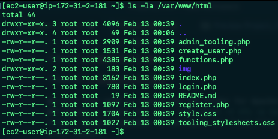

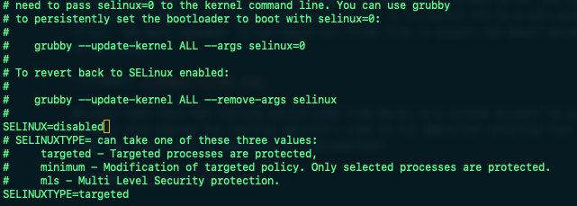

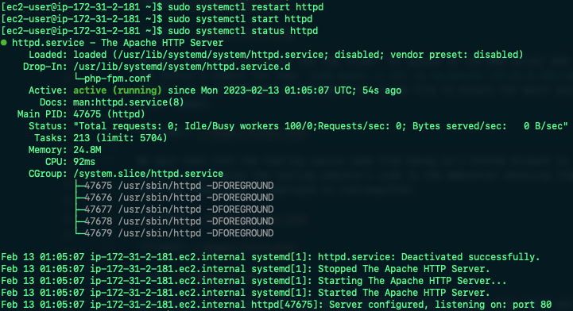

Now we must update the website's configuration to connect to the DB (in /var/www/html/functions.php file). We can apply the tooling-db.sql script to our DB using `mysql -h <databse-private-ip> -u <db-username> -p <db-pasword> < tooling-db.sql` 

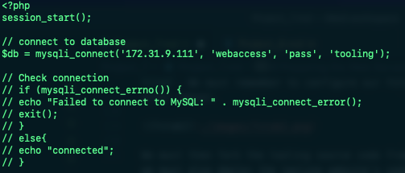

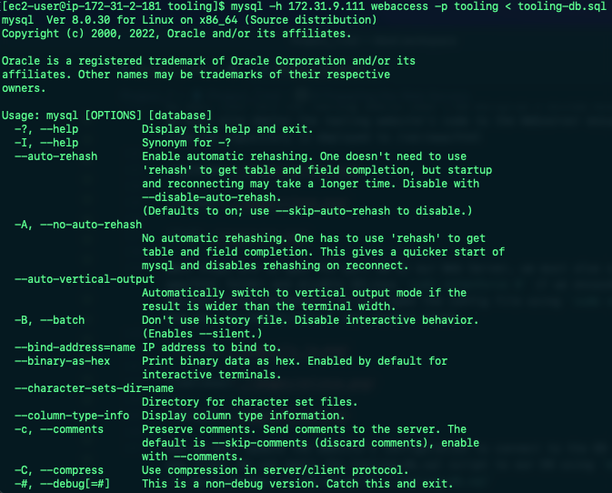

Create a new admin user with username 'myuser' and password 'password'

```
INSERT INTO ‘users’ (‘id’, ‘username’, ‘password’, ’email’, ‘user_type’, ‘status’) VALUES
-> (1, ‘myuser’, ‘password’, ‘user@mail.com’, ‘admin’, ‘1’);
```

We should now be able to open the website in our browser "http://<Web-Server-Public-IP-Address-or-Public-DNS-Name>/index.php" and log into the website with the user that we have created.

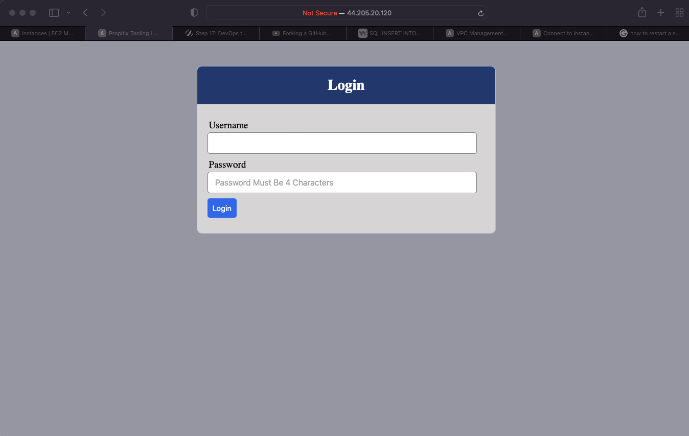

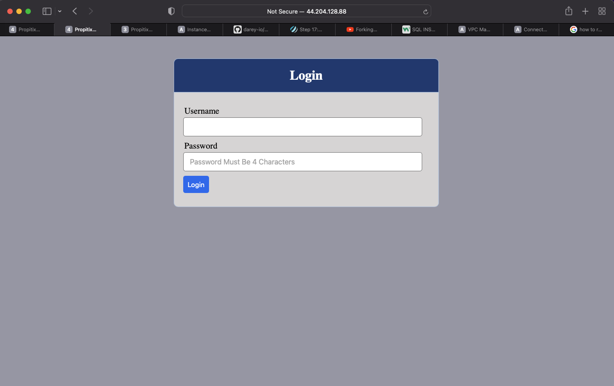

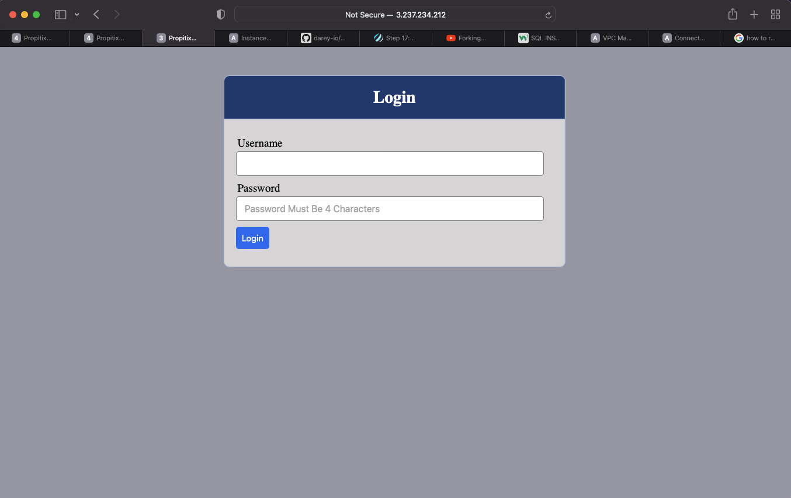

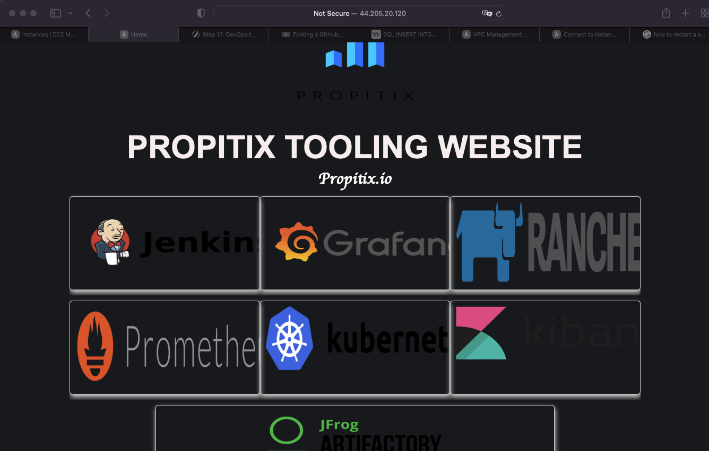


