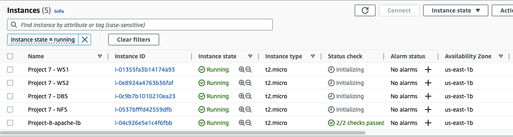
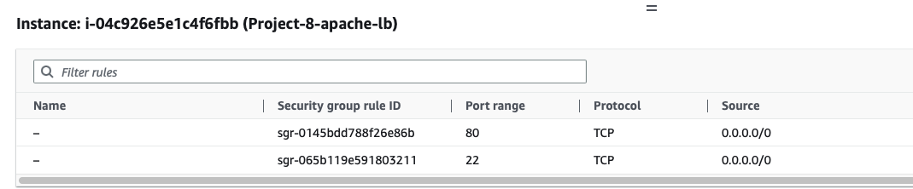
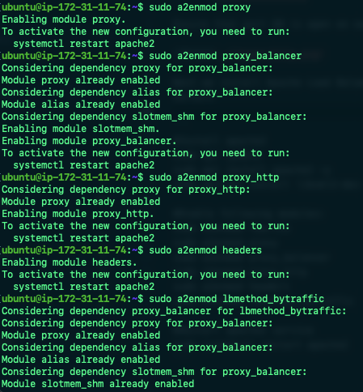
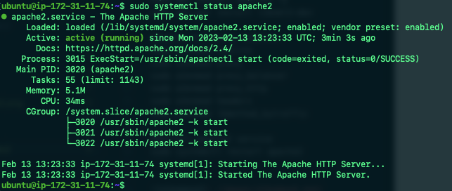
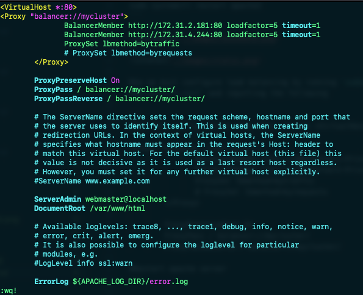
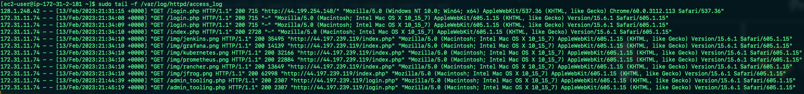

In this project we will be building on our Tooling Website solution in Project 7. We will be deploying and configuring an Apache Load Balancer and make sure that users can be served by Web Servers through the Load Balancer.

# Configuring Apache as a load balancer

First step is to create an Ubuntu EC2 instance named "Project-8-apache-lb" we will also be using the same EC2 instances as Project 7 but we will be leaving Web Server 3 out for this Project. 



Ensure that port 80 is open on our new Ubuntu EC2 instance 



Next we install Apache Load Balancer and configure it to point traffic coming to LB to both Web Servers, make sure apache2 is up and running by using `sudo systemctl status apache2`

```
#Install apache2
sudo apt update
sudo apt install apache2 -y
sudo apt-get install libxml2-dev

#Enable following modules:
sudo a2enmod rewrite
sudo a2enmod proxy
sudo a2enmod proxy_balancer
sudo a2enmod proxy_http
sudo a2enmod headers
sudo a2enmod lbmethod_bytraffic

#Restart apache2 service
sudo systemctl restart apache2
```





Now we must configure load balancing by running `sudo vi /etc/apache2/sites-available/000-default.conf` and inputting the following 

```
#Add this configuration into this section <VirtualHost *:80>  </VirtualHost>

<Proxy "balancer://mycluster">
               BalancerMember http://<WebServer1-Private-IP-Address>:80 loadfactor=5 timeout=1
               BalancerMember http://<WebServer2-Private-IP-Address>:80 loadfactor=5 timeout=1
               ProxySet lbmethod=bytraffic
               # ProxySet lbmethod=byrequests
        </Proxy>

        ProxyPreserveHost On
        ProxyPass / balancer://mycluster/
        ProxyPassReverse / balancer://mycluster/

#Restart apache server
```

Once finished run `sudo systemctl restart apache2` the "bytraffic" LB method will distribute incoming load between our Web Servers according to current traffic load. We can control in which proportion the traffic must be distrinbuted by loadfactor parameter.



*Note: There are also other LB methods such as bybusyness, byrequests and heartbeat* 

We can verify that our configuration works by trying to access our LB's public address or public DNS name from our browser "http://<Load-Balancer-Public-IP-Address-or-Public-DNS-Name>/index.php"


To verify that our load balancing solution works we must run the following command on our two Web Servers `sudo tail -f /var/log/httpd/access_log`, we must then refresh our browser page and make sure both servers recieve HTTP GET requests from our LB. If the number of requests to each server are approximately the same it means that traffic will be distributed evenky between them (Since we set loadfactor to the same value for both servers)




