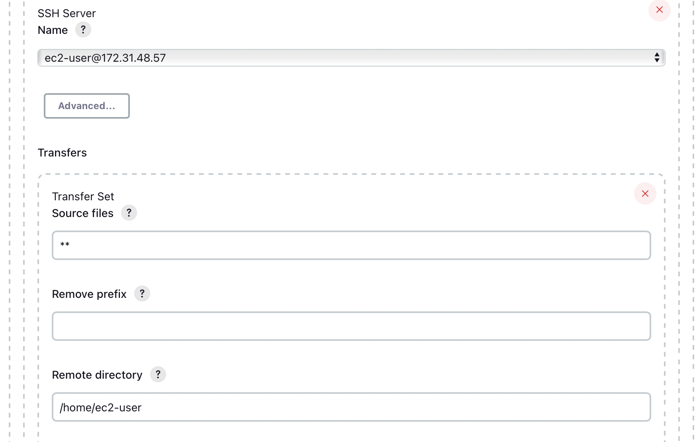

This project will involve enhancing the architecture prepared in Project 8 by adding a Jenkins server. We will configure a job to automatically deploy source codes from Git to our NFS Server.

# Installing and configuring Jenkins server

First we must create an AWS EC2 Ubuntu server named "Jenkins" and install JDK by using `sudo apt update` and `sudo apt install default-jdk-headless`

Next step is to install Jenkins, once complete make sure it is up and running by running the command `sudo systemctl status jenkins` 

As Jenkins server uses TCP port 8080 by default we must must create a new inbound rule in our EC2 Security Group 

We must now access this link "http://<Jenkins-Server-Public-IP-Address-or-Public-DNS-Name>:8080" from our browser, once here we will be prompted to provide a default admin password that we can retrieve by using `sudo cat /var/lib/jenkins/secrets/initialAdminPassword` 

We will then be asked which plugins to install, here we select suggested plugins 

Once complete we can create an admin user and we will get our Jenkins server address

# Configuring Jenkins to retrieve source codes from GitHub using Webhooks

During this step we will learn how to configure a simple Jenkins job. This job will be triggered by GitHub webhooks and will execute a 'build' task to retrieve codes from GitHub and store it locally on our Jenkins Server.

First we must enable webhooks in our GitHub repository settings 

Next step is to create a new freestyle project in the Jenkins web console 

Now select Git repository and provide the link to our Tooling GitHub repository and credentials so Jenkins can access files in the repository

Once we have saved the configuration we can try to manually run the build by clicking the "Build Now" button, if we are successful we should see it under #1 and we can check in "Console Output". 

We can automate our build by clicking "Configure" and configuring our build to trigger the job from GitHub webhook and "Post-build Actions" to archive all the files (files resulted from a build are called artifacts)

To test our configuration works we can make some changes to any file in our GitHub repository and push the changes to the master branch. If it works we will see a new build launched automatically (by webhook) and see artifacts saved on Jenkins server.

*Tip: By default, the artifacts are stored on Jenkins server locally `ls /var/lib/jenkins/jobs/tooling_github/builds/<build_number>/archive/`*

# Configuring Jenkins to copy files to NFS server via SSH

Our next step is to copy our artifacts (saved locally on our Jenkins Server) to our NFS server to /home/ec2-user directory. To do this we will need a plugin called "Publish Over SSH"

Manage Jenkins -> Manage Plugins -> Search for "Publish Over SSH" on Available tab and install 

Now we must navigate back to main dashboard and select Manage Jenkins -> Configure System, once here we scroll down to Publish over SSH plugin configuration section and configure it to be able to connect to our NFS Server. After filling in the details test the configuration and make sure the connection returns "Success"

*Note: must include private key, arbitrary name, hostname, username and remote directory -> Remember TCP port 22 must be open on NFS Server to recieve SSH connections*

Save the configuration, open our Jenkins job/project configuration page and add another one "Post-build Action"

Now we must configure it to send all files produced by the build into our previouslys defined remote directory. In our case we want to copy all files and directories – so we use **

Save this configuration and go ahead, change something in our README.MD file in our GitHub Tooling repository. Webhook will trigger a new job and in the "Console Output" of the job we will find something like this:

To make sure that the files in /home/ec2-user have been udated – connect via SSH/Putty to our NFS server and check README.MD file, if we can see our changes we previously made in our GitHub – the job works as expected 

